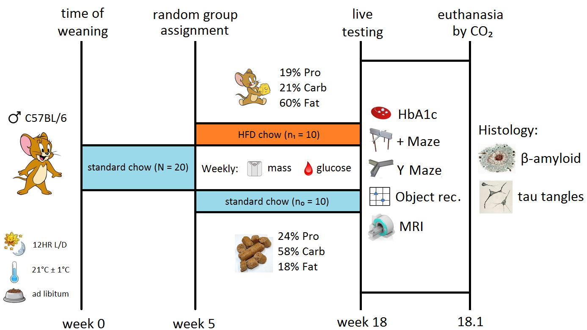

*Does high fat diet induced type two diabetes causes impaired cognitive abilities and dementia?*
====

In 2016 Type 2 Diabetes (T2D) and Alzheimer's Disease (AD) were the underlying cause of death for 2,401 (7.8 per 10⁴) and 4,279 (13.2 per 10⁴) persons respectively (ABS 2017). Both conditions are chronic and sufferers incur clinically meaningful cognitive decline (CD) during their protracted deterioration. The surge in T2D, and seeming inevitability with which it precedes CD/AD, has harrowing implications for both the individual and society. Further research on the relationship is imperative to mitigate the ongoing harm.

The aetiology of T2D is summarised by the 2008 Twin Cycle Hypothesis (Taylor & Barnes 2018). Excess energy substrate from a hypercaloric Western 'high-fat diet' (HFD) is stored as triglyceride in subcutaneous adipose tissue. Upon reaching storage capacity surplus triglyceride accrues into organs (i.e. ectopic fat deposition), particularly the liver and pancreas, driving selective hepatic insulin resistance and β-cell dedifferentiation (Tersey et al. 2018). The final state is a self-reinforcing cycle of chronic hyperglycaemia and hyperinsulinaemia with systemic insulin resistance.

In contrast to T2D, AD has many forms and definitions, with symptoms often overlapping with other variants of dementia. Within this research it was defined as regional aggregation of extracellular β-amyloid (Aβ) plaques and intracellular hyperphosphorylated microtubule-binding tau protein tangles (Masters et al. 2015). Both inclusions must be present, insoluble and aggregated to meet the definition of AD.

Human cross-sectional research reveals that T2D precedes non-demented CD across all cognitive domains. The greatest declines are observed in cognitive speed, mental flexibility and memory (van den Berg et al. 2009). It has a strong relationship with CD, biomarkers of neurodegeneration, and likelihood of AD diagnosis (Biessels & Despa 2018). Prior to complete AD onset, impairments in global cognition, episodic memory, visuospatial function and semantic memory are observed (Baker et al. 2016).

The suggested mechanisms by which T2D drives CD/AD are both neurological and metabolic. In support of neurological hypotheses, long-term reductions in cortical volume (Peng et al. 2015) and regional cerebral blood flow are observed (Willeumier, Taylor & Amen 2011). Metabolic hypotheses focus on mitochondria, given that oxidative phosphorylation of glucose is the main source of energy for neurons. Dysfunctions characterising T2D increase reactive oxygen species production resulting in 'accelerated aging'. This can be observed through glycated hemoglobin (e.g. HbA1c), which correlates directly with AD and inversely with working memory, executive functioning, learning and psychomotor performance (Cardoso et al. 2013). Advanced T2D shows additional reductions in brain mitochondria antioxidant defences and development of advanced glycation end-products (Moreira 2018).

While the connection between T2D and CD is robust, the relationship between T2D and AD does not present in large-scale brain autopsy research. T2D patients do not have an increased likelihood of Aβ plaques postmortem, and only those genetically predisposed (i.e. APOE ε4 allele) possesed increased tau tangles (Arvanitakis et al. 2006, Dos Santos Matioli et al. 2017, Moran et al. 2015). Establishing a clear connection between HFD-induced T2D and CD/AD represents a gap in the research. Experimental laboratory condition using model organisms allow ideal circumstances to be created and tested to show whether the relationship manifests.

It was hypothesised that HFD would induce T2D and that this would be associated with CD in mice. It was further hypothesised that a complete AD symptomology (i.e. Aβ plaques, tau protein tangles) would not present in mice brains, yet the use of ideal experimental conditions would allow causal testing of this theory.

EXPERIMENTAL DESIGN
====

A literature review of prior research was conducted to determine the most suitable experimental design. Most published papers have a similar structure wherein a sample of mice or rats are randomly assigned to a 'standard chow' control group or 'HFD chow' experimental group. Weekly measurements of obesity and disease status (e.g. mass, blood glucose) are taken to track progression. Once sufficient time has passed for pathology to manifest the animals are exposed to behavioural and neurological testing, followed by sacrifice and histology. The main division in the literature is the use of either wild-type (WT) or transgenic animal models.

WT protocols typically use C57BL/6 mice or Wistar rats and focus on CD over AD. Impairments from HFD-induced T2D reliably occur in long-term spatial memory (Dong et al. 2015), working spatial memory (Almeida-Suhett et al. 2017) and operant memory (McNeilly et al. 2012). Two points of note emerge from such trials. First, the degree of obesity in experimental animals influences performance on behavioural tests. The length of the current protocol was adjusted accordingly. Second, Aβ plaques and tau tangles do not aggregate in WT mice or rats as these proteins do in humans.

The transgenic protocols meeting the definition of AD within this paper used the triple-transgenic 3xTg-AD mouse that displays both Aβ plaques and tau tangles at 15 months of age (Oddo et al. 2003). HFD-induced T2D results in similar impairments in spatial and working memory (Sah et al. 2017), long-term memory formation (Kim et al. 2017), spatial reference memory and object recognition (Vandal et al. 2014). Importantly, while all 3xTg-AD mice will eventually manifest complete AD, HFD accelerates onset (Julien et al. 2010).

This last outcome was used to justify the use of a WT C57BL/6 model. Given enough time all 3xTg-AD mice will develop AD, and CD is observed before this regardless of diet. As such, it cannot be proven that HFD-induced T2D causes CD/AD, merely accelerates onset of transgenically inserted predispositions. Similarly, C57BL/6 mice do not acquire AD as they lack these genetic predispositions. However, C57BL/6 mice can show a causal connection between HFD-induced T2D and CD. As causation was the priority of this paper this well-accepted WT model was selected.

The overall design was determined by the above papers. Sample size was determined using a 2-sample-equality power analysis of the C57BL/6 research. Group differences in prior research for hippocampal cell density (Dong et al. 2015), Y-maze % alternations (Almeida-Suhett et al. 2017) and amyloid precursor protein (McNeilly et al. 2012) were used as parameters. Power analysis showed that group sizes of 8 were sufficient, however 10 were used as a conservative estimate without overpowering. The design is summarised below in Figure 1.

Figure 1. Design summary of high-fat-diet induced type 2 diabetes testing protocol. Under standard laboratory conditions, wild-type C57BL/6 were fed standard show for 5 weeks before half were randomly assigned to high-fat-diet chow for 13 weeks. Single-blinded staff carried out live testing followed by animal sacrifice and brain histology.

The experimental design consisted of an 18 weeks long, two-group (i.e. standard chow vs. HFD) randomised controlled trial using male WT C57BL/6J mice. Laboratory staff were single-blinded to the feeding conditions of animals and brain samples. Measures were conducted at appropriate timing for each (e.g. weekly/one-off, histology after death, etc.). The 20 male C57BL/6J mice were maintained under standard laboratory conditions for the duration of the study (i.e. ad libitum access to food and water, 21°C, 12HR light/dark cycle).

Mice were fed the 2018 Teklad global 'standard chow' diet (T.2018; 24.0 Protein, 58.0 Carbohydrate, 18.0 Fat %kcal) for five weeks. From weeks 5 through 18, half were randomly assigned to an experimental 'HFD chow' diet group (TD.06414; 18.4 Protein, 21.3 Carbohydrate, 60.3 Fat %kcal). The remaining half stayed on standard chow as the control group. At week 18 behavioural tests, HbA1c and Magnetic Resonance Imaging (MRI) were conducted prior to euthanasia by CO 2 and histology. Each time a test is performed, the animal was rested for one day prior to then next test, minimising the influence of anxiety on test performance. Each stage of the protocol was conducted in accordance with Monash University Animal Ethics Committee guidelines.

TESTING VARIABLES
====

Variables included in the protocol were measured weekly, once-off or after sacrifice. Weekly measurements included mass (g) and blood glucose (mmol/L) between weeks 5 and 18. At week 18, a cycle of testing was conducted that included glycated hemoglobin (HbA1c), brain volume (L), Elevated Plus Maze (% open arms), Y-Maze (% spontaneous alterations), and Object Recognition Test (preference index). Finally, after animals were sacrificed, brain histology included testing for Aβ plaques (plaques/cell) and tau protein tangles (tangles/cell). Each test is described in detail below.

### FASTING BLOOD GLUCOSE and HbA1C

We measured the fasting blood glucose levels of both control and HFD groups at the end of each week after HFD treatment began. All mice were fasted for 6 hours post their first meal in the morning. The blood glucose was measured on glucometer using a drop of whole blood from the animal's tail (Wang et al. 2012).

HbA1c level was measured at the end of week 18 to confirm T2D in the HFD treatment group and the absence of T2D in the standard chow group. It was measured from the whole blood using DCA 2000 analyser (Han et al. 2008). The analyser uses ~5 μl of whole blood to produce automated readings of the HbA1c level.

### ELEVATED PLUS MAZE

The Elevated Plus Maze was the first behavioural test that we conducted at week 18. The purpose of this test was to compare the anxiety of the mice between control and the treatment group. This is to take into account the effect of anxiety on the performance of the mice in the Y-Maze and Object Recognition Test.

For the Elevated Plus Maze, we determined the time an animal spent in the open arms of the maze versus total time. A long time spent exploring the open arm of the maze mean that the animal is less anxious. The test was performed as per protocol written by Walf and Frye (2007). The maze was composed of two open and two closed arms elevated 50 cm from the ground. The light in the testing room was dimmed to 30-35 lux to reduce test animal anxiety.

Each mouse was placed at the intersection of open and closed arms facing away from the experimenter. The mice were allowed to explore the maze for 10 minutes and the movement was recorded by the camera mounted above the maze. The maze was thoroughly cleaned before and after an animal was tested. The recorded video was used to score the time spent in the closed and open arms. An entry was defined when all four paws of the animal was within the arm. Finally, percentage time spent in the open arm was calculated by the formula below.

*Time in Open Arms (%) = ( Time spent in open arms / Total time ) x 100*

### Y-MAZE SPONTANEOUS ALTERNATION

One day after completion of the anxiety test, we performed the Y-Maze Spontaneous Alternation test. The purpose of this test was to determine the effect of HFD on the spatial working memory of the animals (Lalonde 2002). This test relies on the innate tendency of the mice to explore new environments. Here, we compared the percentage alternation between control and HFD treated animals.

The task was designed based on the protocol written by Miedel et al (2017). The light in the testing room was dimmed to 30-35 lux to reduce animal's anxiety. The maze was thoroughly cleaned between and before the test was performed to remove any cues. Initially, we allowed animals to explore the maze for 5 minutes in order to habituate to the maze. A day later, the testing session was performed for 5 minutes using the same conditions as habituation session.

We used the recorded video to score the number of alternation and total number of entries for each mice. An entry was defined when all four paws of the animal was within the arm. The following formula calculated the percentage alternation for each mouse.
 
*Spontaneous Alternation (%) = ( alternations / arm entries - 2 ) x 100*

### OBJECT RECOGNITION TEST

The mice performed the Object Recognition Test one day after completing the Y-Maze. The purpose of this task was to determine the effect of HFD on the recognition memory of the mice. This test relies on the innate tendency of the mice to explore novel objects. Here, we compared the time spent exploring the novel object between control and HFD treated group.

The task was designed based on the protocol written by Lueptow (2017). The light in the testing room was dimmed to 30-35 lux to reduce animal anxiety. The arena and the objects were thoroughly cleaned before and between testing animals. During habituation, the animals were allowed to explore the empty arena for 5 minutes. After 24 hours, the animals were allowed to explore the arena containing two identical objects. Two hours later, one of the objects were replaced with a novel object and the animals were allowed to explore the arena for 10 minutes. We performed the test two hours later to allow the control group to remember the object used in the training session.
We used the recorded video to score the time each animal spent exploring the novel object. The following formula determined the preference index for each animal.

*Preference index = ( time exploring the novel object / total time ) x 100*

### MAGNETIC RESONANCE IMAGING
An MRI was performed immediately after the Object Recognition Test. The purpose of the MRI was compare the cerebral cortex volume between the control and the HFD treated group. The animals were anaesthetised using 4% isoflurane and 4 L/min O 2. The immobilized animals were loading into the loading array while was placed into the magnet. Then we performed a fast spin eco-sequence to obtain a 3D struction of their brain. We used voxel-based morphometry approach to determine cortical thickness ( Hutton et al, 2008). For more details about the protocol refer to Dazai et al (2011).

### NEURITIC β-AMYLOID PLAQUES & TAU TANGLES

The mice were euthanized by CO 2immediately after MRI. The brains were extracted to be stained for neuritic plaques and tau tangles. We performed these tests because AD is defined by formation of neuritic Aβ plaques and tau tangles (Masters et al. 2015).

To stain for neuritic Aβ plaques, we fixed the brain of control (n=3) and HFD treated (n=3) mice with 4% paraformaldehyde followed by 30% sucrose solution. We then embedded the fixed brains in OTC and the sections were stain for neuritic plaques using thioflavin S solution (1% in 80% ethanol). We compared the level of neuritic Aβ plaques formation between control and HFD treatment group. For more details about this protocol, refer to Ly et al (2011).

To stain for tau tangles, we fixed the brain of control (n=3) and HFD treated (n=3) mice in 4% paraformaldehyde and 20% glycerol. The fixed brains were snap frozen and the sections were stained with primary antibody (5A6) against tau tangles. The primary antibodies were then labelled with secondary antibodies conjugated to CY3 fluorescent to be visualised under microscope. We then compared the number of tau tangles per cell between HFD treatment and control group. For more details about this protocol, refer to de Calignon et al (2012).

STATISTICAL ANALYSES
====

Alpha was set to 0.05 for all statistical tests. Two-factor repeated measures ANOVAs compared the weekly fasting glucose level and body mass between control and HFD treatment group (i.e. between-subjects comparison). One-tailed independent t-tests compared the HbA1c, % time spent in open arms, % spontaneous alternation, preference index, cortical thickness, Aβ plaques/cell and tau tangles/cell between the control and HFD treatment group. Bonferroni correction was applied to control the familywise error rate inflation caused by the use of multiple statistical tests.

LIMITATIONS & FUTURE RESEARCH
====

In addition to the methodological challenge of animal model selection and AD potential discussed above, the main limitation of the protocol was the confounding variable of obesity. There are few noncommunicable diseases that the obese state is not associated with (Ren, Sowers & Zhang 2018), and as mice with HFD-induced T2D are obese, any CD/AD observed could be a consequence of this broader syndrome.

A possible alternative for future research is the Goto-Kakizaki non-obese T2D rat (Goto, Kakizaki & Masaki 1975). However, HFD hypotheses are not possible with this model, as it spontaneously suffers T2D regardless of diet. A speculative alternative may be the creation of a non-obese T2D animal that only develops T2D when exposed to a hypercaloric 'Western' diet. This phenomenon is observed in unique 'Lean T2D' (BMI<23kg/m²) Chinese Han populations, for which the single-nucleotide polymorphisms are available (Kong et al. 2016). This information could be leveraged to develop new transgenic models specifically for the study of HFD-induced T2D.

CONCLUSION
====

This project aims to show whether HFD-induced T2D causes CD and AD. We expect that a HFD will induce T2D, tested by weekly fasting blood glucose levels and by glycated haemoglobin (i.e. HbA1c) at week 18. We expect the HFD treatment group to perform worse in spatial working memory and recognition memory compared to standard chow controls, tested by the Y-Maze (% spontaneous alternation) and Object Recognition test (preference index). Finally, we expect lower cerebral cortex thickness in HFD treatment group compared to control. However, we do not expect to observe fully formed β-amyloid plaques or tau tangles in either the control or HFD treatment group.

By choosing a WT mouse model, the main project outcome was a strong, causal connection between an HFD-induced T2D state and CD. Furthermore, it showed whether in ideal experimental conditions HFD-induced T2D caused AD, which was not possible in free-living population research (e.g. human brain autopsy surveys). The noted genetic criticisms of using a WT mouse model to test this hypothesis (i.e. mice lack genetic predisposition) invited broader discussion on the true 'cause' of the disease.

Conclusions were supported by multiple behavioural and neurological tests with potential generalisability to other organisms (e.g. humans). Generalisability was reduced by methodological limitations in terms of appropriate AD animal model selection and the confounder of obesity. However, several promising pathways to correct these shortcomings exist and provide ample opportunity for future research.

REFERENCES
====

Almeida-Suhett, CP, Scott, JM, Graham, A, Chen, Y & Deuster, PA 2017, 'Control diet in a high-fat diet study in mice: Regular chow and purified low-fat diet have similar effects on phenotypic, metabolic, and behavioral outcomes', Nutritional Neuroscience, pp. 1-10.

Australian Bureau of Statistics, '3303.0 - Causes of Death, Australia, 2017', accessed 5 October 2018 http://www.abs.gov.au/ausstats/abs@.nsf/mf/3303.0

Arvanitakis, Z, Schneider, JA, Wilson, RS, Li, Y, Arnold, SE, Wang, Z & Bennett DA 2006, 'Diabetes is related to cerebral infarction but not to AD pathology in older persons', Neurology , vol. 67, no. 11, pp. 1960-1955.

Baker, JE, Lim, YY, Pietrzak, RH, Hassenstab, J, Snyder, PJ, Masters, CL & Maruff, P 2016, 'Cognitive impairment and decline in cognitively normal older adults with high amyloid-β: A meta-analysis', Alzheimer's & Dementia, vol. 6, pp. 108-121.

van den Berg, E, Kloppenborg, RP, Kessels, RP, Kappelle, LJ & Biessels, GJ 2009, 'Type 2 diabetes mellitus, hypertension, dyslipidemia and obesity: A systematic comparison of their impact on cognition', Biochimica et Biophysica Acta , vol. 1792, no. 5, pp. 470-481.

Biessels, GJ & Despa, F 2018, 'Cognitive decline and dementia in diabetes mellitus: Mechanisms and clinical implications', Nature Reviews Endocrinology , vol. 14, no. 10, pp. 591-604.

de Calignon, A, Polydoro, M, Suárez-Calvet, M, William, C, Adamowicz, DH, Kopeikina, KJ, Pitstick, R, Sahara, N, Ashe, KH, Carlson, GA, Spires-Jones, TL & Hyman, BT 2012, 'Propagation of tau pathology in a model of early Alzheimer's disease', Neuron , vol. 73, no. 4, pp. 685-697.

Cardoso, S, Correia, SC, Santos, RX, Carvalho, C, Candeias, E, Duarte, AI, Plácido, AI, Santos, MS & Moreira, PI 2013, 'Hyperglycemia, hypoglycemia and dementia: Role of

mitochondria and uncoupling proteins', Current Molecular Medicine , vol. 13, no. 4, pp. 586-601.

Dazai, J, Spring, S, Cahill, LS & Henkelman, RM 2011, 'Multiple-mouse neuroanatomical magnetic resonance imaging', Journal of Visualized Experiments: JoVE , vol. 48. Dong, W, Wang, R, Ma, LN, Xu, BL, Zhang, JS, Zhao, ZW, Wang & YL, Zhang, X 2015, 'Autophagy involving age-related cognitive behavior and hippocampus injury is modulated by different caloric intake in mice', International Journal of Clinical and Experimental Medicine , vol. 8, no. 7, pp. 11843-11853.

Dos Santos Matioli, MNP, Suemoto, CK, Rodriguez, RD, Farias, DS, da, Silva, MM, Leite, REP, Ferretti-Rebustini, REL, Farfel, JM, Pasqualucci, CA, Jacob, Filho, W, Arvanitakis, Z, Naslavsky, MS, Zatz, M, Grinberg, LT & Nitrini, R 2017, 'Diabetes is not associated with alzheimer's disease neuropathology', Journal of Alzheimer's Disease , vol. 60, no. 3, pp. 1035-1043.

Goto, Y, Kakizaki, M & Masaki, N 1975, 'Spontaneous diabetes produced by selective breeding of normal Wistar rats', Proceedings of the Japan Academy , vol. 51, pp. 80-85. Han, BG, Hao, CM, Tchekneva, EE, Wang, YY, Lee, CA, Ebrahim, B, Harris, RC, Kern, TS, Wasserman, DH, Breyer, MD & Qi, Z 2008, 'Markers of glycemic control in the mouse: Comparisons of 6-h- and overnight-fasted blood glucoses to Hb A1c', American Journal of Physiology-Endocrinology and Metabolism , vol. 295, no.4, pp. 981-986. Hutton, C, De Vita, E, Ashburner, J, Deichmann, R & Turner, R 2008, 'Voxel-based cortical thickness measurements in MRI', Neuroimage , vol. 40, no. 4, pp. 1701-1710. Julien, C, Tremblay, C, Phivilay, A, Berthiaume, L, Emond, V, Julien, P & Calon, F 2010, 'High-fat diet aggravates amyloid-beta and tau pathologies in the 3xTg-AD mouse model', Neurobiology of Aging , vol. 31, no. 9, pp. 1516-1531.

Kim, D, Cho, J, Lee, I, Jin, Y & Kang H 2017, 'Exercise attenuates high-fat diet-induced disease progression in 3xTg-AD mice', Medicine & Science in Sports & Exercise , vol. 49, no. 4, pp. 676-686.

Kong, X, Xing, X, Hong, J, Zhang, X & Yang, W 2016, 'Genetic variants associated with lean and obese type 2 diabetes in a Han Chinese population: A case-control study', Medicine , vol. 95, no. 23, pp. 3841.

Lalonde, R 2002, 'The neurobiological basis of spontaneous alternation', Neuroscience & Biobehavioral Reviews , vol. 26, no. 1, pp. 91-104.

Lueptow, LM 2017, 'Novel Object Recognition Test for the Investigation of Learning and Memory in Mice', Journal of Visualized Experiments: JoVE , vol. 126.

Ly, PT, Cai, F & Song, W 2011, 'Detection of neuritic plaques in Alzheimer's disease mouse model', Journal of Visualized Experiments: JoVE , vol. 53.

Masters, CL, Bateman, R, Blennow, K, Rowe, CC, Sperling, RA, & Cummings, JL 2015, 'Alzheimer's disease', Nature Reviews Disease Primers , vol, 1, no. 15056. McNeilly, AD, Williamson, R, Balfour, DJ, Stewart, CA & Sutherland, C 2012, 'A high-fat-diet-induced cognitive deficit in rats that is not prevented by improving insulin sensitivity with metformin', Diabetologia , vol. 55, no. 11, pp. 3061-3070. Miedel, CJ, Patton, JM, Miedel, AN, Miedel, ES & Levenson, JM 2017, 'Assessment of spontaneous alternation, novel object recognition and limb clasping in transgenic mouse models of amyloid-β and tau neuropathology', Journal of Visualized Experiments: JoVE , vol. 123.

Moran, C, Beare, R, Phan, TG, Bruce, DG, Callisaya, ML, Srikanth, V; Alzheimer's Disease Neuroimaging Initiative (ADNI) 2015, 'Type 2 diabetes mellitus and biomarkers of neurodegeneration', Neurology , vol. 85, no. 13, pp. 1123-1230.

Moreira, PI 2018, 'Sweet mitochondria: A shortcut to Alzheimer's disease', Journal of Alzheimer's Disease , vol. 62, no. 3, pp. 1391-1401.

Oddo, S, Caccamo, A, Shepherd, JD, Murphy, MP, Golde, TE, Kayed, R, Metherate, R, Mattson, MP, Akbari, Y & LaFerla, FM 2003, 'Triple-transgenic model of Alzheimer's disease with plaques and tangles: Intracellular Abeta and synaptic dysfunction', Neuron , vol. 39, no. 3, pp. 409-421.

Peng, B, Chen, Z, Ma, L & Dai, Y 2015, 'Cerebral alterations of type 2 diabetes mellitus on MRI: A pilot study', Neuroscience Letters , vol. 606, pp. 100-105.

Ren, J, Sowers, JR & Zhang, Y 2018, 'Metabolic stress, autophagy, and cardiovascular aging: From pathophysiology to therapeutics', Trends in Endocrinology and Metabolism , vol. 29, no. 10, pp. 699-711.

Sah, SK, Lee, C, Jang, JH & Park, GH 2017, 'Effect of high-fat diet on cognitive impairment in triple-transgenic mice model of Alzheimer's disease', Biochemical and Biophysical Research Communications , vol. 493, no. 1, pp. 731-736.

Taylor, R & Barnes, AC 2018, 'Translating aetiological insight into sustainable management of type 2 diabetes', Diabetologia , vol. 61, no. 2, pp. 273-283.

Tersey, SA, Levasseur, EM, Syed, F, Farb, TB, Orr, KS, Nelson, JB, Shaw, JL, Bokvist, K, Mather, KJ & Mirmira, RG 2018, 'Episodic β-cell death and dedifferentiation during diet-induced obesity and dysglycemia in male mice', The FASEB Journal , Epub ahead of print.

Vandal, M, White, PJ, Tremblay, C, St-Amour, I, Chevrier, G, Emond, V, Lefrançois, D, Virgili, J, Planel, E, Giguere, Y, Marette, A & Calon F 2014,' Insulin reverses the high-fat diet-induced increase in brain Aβ and improves memory in an animal model of Alzheimer disease', Diabetes , vol. 63, no. 12, pp. 4291-4301.

Walf, AA & Frye, CA 2007, 'The use of the elevated plus maze as an assay of anxiety-related behavior in rodents', Nature Protocols , vol. 2, no. 2, pp. 322-328.

Wang, CY & Liao, JK 2012, 'A mouse model of diet-induced obesity and insulin resistance', In mTOR , pp. 421-433. Humana Press.

Willeumier, KC, Taylor, DV & Amen, DG 2011, 'Elevated BMI is associated with decreased blood flow in the prefrontal cortex using SPECT imaging in healthy adults', Obesity , vol. 19, no. 5, pp. 1095-1097.
