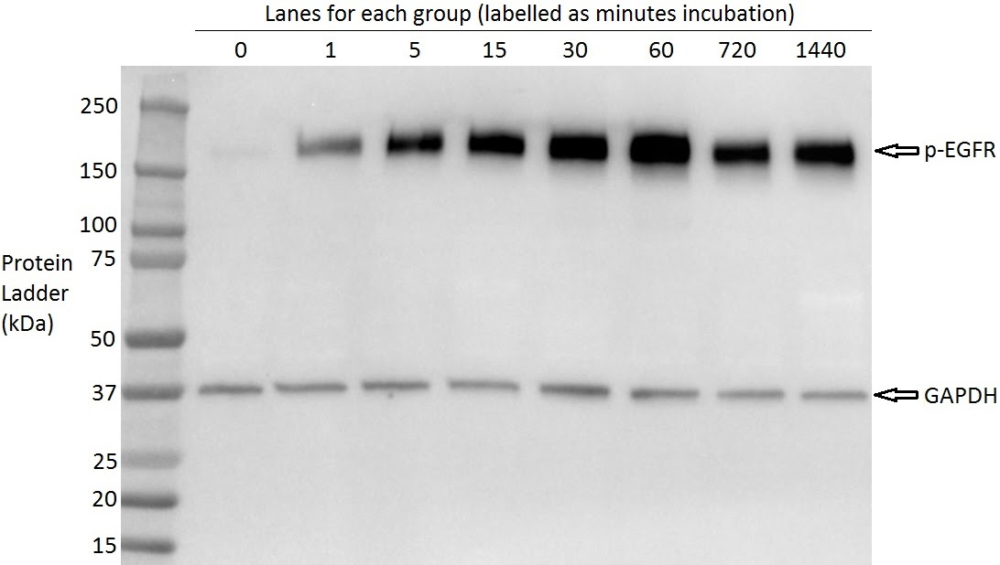

*Effects of epidermal growth factor on epidermal growth factor receptor phosphorylation across time in A431 cells*
===========================

Squamous cell carcinoma (SCC) has an high lifetime incidence in Australia and the USA (Perera et al. 2015, Rogers et al. 2015). High regional prevalence has been attributed to the tumorigenic effect of ultraviolet radiation (Narayanan, Saladi & Fox 2010, Armstrong & Kricker 2001). Recommendations to avoid such risk factors conflict with local cultural practices and are unhelpful to those already effected. Research on SCC oncogenic signalling pathways is necessary to produce treatment options addressing the growing burden of this disease.

A high proportion of malignant tumours over-express the epidermal growth factor (EGF) receptor (EGFR; Grandis & Sok 2004). In concert with other factors and macromolecules, EGF encourages cell differentiation and proliferation while preventing apoptosis. Increased EGFR expression is a statistically significant predictor of disease progression and patient survival (Rubin Grandis et al. 1998, Chung et al. 2006, Temam et al. 2007).

EGF is a 6 kDa anabolic signalling protein ubiquitous in human body fluids (e.g. serum, saliva). It binds to EGFR, a 170 kDa receptor tyrosine kinase (RTK), causing autophosphorylation and intracellular second messenger cascades (Ullrich & Schlessinger 1990). RTKs signal through phosphotyrosine residues (Kovacs et al. 2015). EGF binds to the extracellular domain causing dimerisation of the intracellular portion and autophosphorylation. Effector proteins then bind phosphotyrosine residues at specific docking sites to initiate further signal cascades.

Drug discovery research targeting EGFR has expanded rapidly in light of probable utility in treating SCC. A prominent example is Cetuximab, a monoclonal antibody that competitively binds to EGFR, preventing EGF-induced activation (Xu, Johnson & Grandis 2017). Continued basic research on this universal signalling pathway is necessary to produce further treatment options.

The human A431 cell line (Giard et al. 1973) was selected for this research. Over the previous decades this culture has been accepted as a model SCC cell line in oncology. It has a greater expression of EGFR relative to other cancer cultures, binding 3-200 times more EGF per cell (Fabricant et al. 1977).

Time must be considered when studying EGFR activity, as chronic phosphorylation promotes EGFR endocytosis, lysosome fusion and degradation. In healthy squamous epithelium, such reductions in membrane receptor expression serve to attenuate excessive signalling (Sorkin & Goh 2009). Early A431 research indicates peak phosphorylation at 60 minutes (min) with marked down-regulation at 720 min (Hunter & Cooper 1981). An additional 1440 min group can show whether further substantive decreases occur.

The objective of this research was to measure EGFR phosphorylation across a range of time spans. The purpose was to undertake a complete western blotting protocol. This was to include group specific cell incubation, lysis, protein fractionation and chemiluminescent electrobotting.

EGFR phosphorylation increased proportionally with incubation time in the presence of growth factor. Activity increased up to the 60 min group, decreased rapidly for the 720 min group, and stabilised in the remaining 1440 min group. The available data could not show a definitive cause (e.g. receptor endocytosis, insufficient EGF or an unknown process).

METHOD
====

Experimental A431 plates were treated with EGF up to 5 ng/mL then CO² incubated at 37°C for 1, 5, 15, 30, 60, 720 or 1440 min. An additional control plate, not treated with EGF, was stored in the incubator after thawing. All plates were washed with Tris-buffered saline, scraped in STOP-LYSIS buffer to lyse cells and preserve phosphorylation, then iced for 5 min. Supernatant was collected after centrifugation and diluted 10⁻¹ for Thermo Scientific NanoDrop Lite spectrophotometer assessment.

Samples were prepared for fractionation with sodium dodecyl sulfate-polyacrylamide gel electrophoresis (SDS-PAGE). Protein lysate concentration was standarised to 30 µg per well using spectrophotometer data to minimise quantification errors in band intensity. Glyceraldehyde-3-phosphate dehydrogenase (GAPDH), an abundant and relatively constant 37 kDa cellular housekeeping protein, was added for signal normalisation. Samples were denatured at 100°C, cooled for 5 min at 25°C, then run in a Bio-Rad Mini-PROTEAN Tetra Cell with manufacturer precast gels and mass standards.

Gels were electroblot onto polyvinyldifluoride support membranes with a Bio-Rad Trans-Blot Turbo Transfer System. Membranes were washed in blocking buffer (i.e. 5% bovine serum albumin, tris buffered saline, 0.05% Tween 20) to prevent non-specific binding of antibodies to residual protein-binding sites. Washing in 10⁻³ dilutions of anti-phosphotyrosine EGFR and anti-GAPDH primary antibodies bound the experimental and normalisation protein. This was removed with wash buffer (i.e. tris buffered saline, 0.05% Tween 20) then membranes were washed in a 10⁻⁴ dilution of anti-rabbit horseradish peroxidase conjugated antibody. Additional thorough washing removed any excess of this chemiluminescent secondary antibody prior to imaging.

This process was repeated three times to produce three membranes that were captured using a Bio-Rad ChemiDoc Imaging system. Chemiluminscence was quantified in Bio-Rad Image Lab software and analysed using Python 3.6.6.1 64-bit (Appendix A) and MATLAB R2018a (Appendix B).

RESULTS
====

All three western blot membranes were of identical quality and exposure. A full spectrum image of a representative blot is shown below in Figure 1.



Figure 1. Full spectrum exposure of one representative membrane blot. The leftmost lane contains a protein ladder, followed by each time group from the 0 min no-EGF group up to the 1440 min EGF group. p-EGFR and the GAPDH normalisation standard are marked.

According to the included protein ladder the upper line of signal concentration in each well was 6 kDA in mass. This was the correct size for the phosphorylated EGFR (p-EGFR) protein of interest. The band below was the 37 kDa GAPDH protein added for normalisation. Band intensity was extracted for each lane, normalised, converted to fold change and averaged across the three blots. The resulting data are shown below in Figure 2.


Figure 2. Bar plot of mean fold change across time relative to 0 min no-EGF control, including SEM bars (n = 3).

The above bar plot shows that mean fold change increased proportionally with time up to and including the 60 min group. Phosphorylation decreased sharply for the 720 and 1440 min groups, which reflected the 30 and 15 min groups respectively.

One-way analysis of variance (ANOVA) was carried out to test whether the differences between time intervals were statistically significant. To permit the assumption of independence there was no interaction between incubation plates nor visible contamination between gel lanes. The data were normally distributed according to the non-significant Shapiro-Wilk test (W = 0.952, p = 0.299). Levene's test indicated unequal variances between groups (F = 4.731, p < 0.05). However, ANOVA is robust to violations of this assumption when sample sizes are equal (i.e. n = 3 across groups).

The ANOVA showed that time after EGF exposure had a significant effect on fold change [F(7,16) = 45.63, p < 0.05]. Bonferroni post hoc testing, which is conservative and robust to assumption violations, tested the significance of nine group differences. The first seven planned contrasts were between the 0 min no-EGF control and all other groups. All comparisons were significant (p < 0.05) except for the 1 min EGF treated group (p = 0.0857). The eighth contrast between the 60 and 720 min groups showed a significant decrease in fold change (p < 0.05). However, the ninth contrast between the 720 and 1440 min group was not significant (p = 0.32).

DISCUSSION
====

Receptor phosphorylation increased with direct proportionality to time up to and including the 60 min EGF incubation group. Activity decreased rapidly for the second longest time group 720 min. This represented the majority of the decreased fold change, as further reductions in the 1440 min group were not significant.

Rapid activation through early time periods corroborated prior research that EGFR readily phosphorylate upon EGF exposure in A431 cells (Fabricant et al. 1977). The peak response at 60 min, and rapid decline by 720 min, suggested that adaptive down-regulation was conserved (Hunter & Cooper 1981). Such results align with the prevailing endocytosis theory (Sorkin & Goh 2009). However, a western blot alone does not allow speculation in support of the underlying mechanism, endocytotic or otherwise.

The shape of phosphorylation over time, rapid increase then down-regulation, resembles that cited in prior research. The lack of further significant decreases in the 1440 min group makes two contributions to this body of literature. Firstly, it shows that complete down-regulation does not occur within the experimental time scale. Secondly, the rate of attenuation slows, allowing speculation that complete removal of EGFR from the cell membrane does not occur. A potential explanation of this phenomena may be found in the EGFR-binding anti-cancer pharmaceutical Cetuximab (Xu, Johnson & Grandis 2017). Chronic exposure results in drug resistance due to overexpression of oncogenic Ras family proteins and related second messenger activity (Saki, Toulany & Rodemann 2013). There are many areas within the near universal EGFR signalling pathway, including potentially undiscovered mechanisms, for future research questions to focus on.

The use of western blotting introduced several technical limitations to the study. It cannot produce quantitative measures of blot protein mass, and poor blot imaging can distort quantification of band intensity. The method is expensive in terms of equipment, time and staff qualifications. Attempts to reduce costs, such as allowing less time for electroblot transfer, risk corrupting the final research product. Moreover, the technique is constrained to known antibodies, which in turn constrain research questions and distorts field progression.

A design limitation was the possible confounding between the normalisation protein, growth factor and cell type. GAPDH is a common enzyme with a diverse range of functions, including glycolytic catalysis for energy production (Tristan et al. 2011). EGF directly influences this metabolic pathway by upregulating glycolysis in A431 cells (Baulida, Onetti & Bassols 1992). It is unknown whether the resulting change in GAPDH expression corrupted the normalisation or accrued uniformly across conditions. Future research should consider alternative loading controls less prone to such biases.

CONCLUSION
====

Upon exposure to EGF, fold change in p-EGFR increased from 5 min incubation time and peaked after 60 min. Phosphorylation decreased sharply by 720 min and further receptor down-regulation was not significant up to the final 1440 min time group.


REFERENCES
====

Armstrong, BK & Kricker, A 2001, 'The epidemiology of UV induced skin cancer', Journal of Photochemistry and Photobiology B: Biology, vol. 63, pp. 8-18.

Baulida, J, Onetti, R & Bassols, A 1992, 'Effects of epidermal growth factor on glycolysis in A431 cells', Biochemical and Biophysical Research Communications, vol. 183, no. 3, pp. 1216-1223.

Chung, CH, Ely, K, McGavran, L, Varella-Garcia, M, Parker, J, Parker, N, Jarrett, C, Carter, J, Murphy, BA, Netterville, J, Burkey, BB, Sinard, R, Cmelak, A, Levy, S, Yarbrough, WG, Slebos, RJ & Hirsch, FR 2006, 'Increased epidermal growth factor receptor gene copy number is associated with poor prognosis in head and neck squamous cell carcinomas', Journal of Clinical Oncology, vol. 24, no. 25, pp. 4170-4176.

Fabricant, RN, De Larco, JE & Todaro, GJ 1977, 'Nerve growth factor receptors on human melanoma cells in culture', Proceedings of the National Academy of Sciences, vol. 74, no. 2, pp. 565-569.

Giard, DJ, Aaronson, SA, Todaro, GJ, Arnstein, P, Kersey, JH, Dosik, H & Parks, WP 1973, 'In vitro cultivation of human tumors: Establishment of cell lines derived from a series of solid tumors', Journal of the National Cancer Institute, vol. 51, no. 5, pp. 1417-1423.

Grandis, JR & Sok, JC 2004, 'Signaling through the epidermal growth factor receptor during the development of malignancy', Pharmacology & Therapeutics, vol. 102, no. 1, pp. 37-46.

Hunter, T & Cooper, JA 1981, 'Epidermal growth factor induces rapid tyrosine phosphorylation of proteins in A431 human tumor cells', Cell, vol. 24, no. 3, pp. 741-752.

Kovacs, E, Zorn, JA, Huang, Y, Barros, T & Kuriyan, J 2015, 'A structural perspective on the regulation of the epidermal growth factor receptor', Annual Review of Biochemistry, vol. 84, pp. 739-764.

Narayanan, DL, Saladi, RN & Fox, JL 2010, 'Ultraviolet radiation and skin cancer', International Journal of Dermatology, vol. 49, no. 9, pp. 978-986.

Perera, E, Gnaneswaran, N, Staines, C, Win, AK & Sinclair, R 2015, 'Incidence and prevalence of non-melanoma skin cancer in Australia: A systematic review', Australasian Journal of Dermatology, vol. 56, no. 4, pp. 258-267.

Rogers, HW, Weinstock, MA, Feldman, SR & Coldiron, BM 2015, 'Incidence estimate of nonmelanoma skin cancer (keratinocyte carcinomas) in the U.S. population, 2012', JAMA Dermatology, vol. 151, no. 10, pp. 1081-1086.

Rubin Grandis, J, Melhem, MF, Gooding, WE, Day, R, Holst, VA, Wagener, MM, Drenning, SD & Tweardy, DJ 1998, 'Levels of TGF-α and EGFR protein in head and neck squamous cell carcinoma and patient survival', Journal of the National Cancer Institute, vol. 90, no. 1, pp. 824-832.

Saki, M, Toulany, M & Rodemann, HP 2013, 'Acquired resistance to cetuximab is associated with the overexpression of Ras family members and the loss of radiosensitization in head and neck cancer cells', Radiotherapy and Oncology, vol. 108, no. 3, pp. 473-478.

Sorkin, A & Goh, LK 2009, 'Endocytosis and intracellular trafficking of ErbBs', Experimental Cell Research, vol. 315, no. 4, pp. 683-696.

Temam, S, Kawaguchi, H, El-Naggar, AK, Jelinek, J, Tang, H, Liu, DD, Lang, W, Issa, JP, Lee, JJ & Mao, L 2007, 'Epidermal growth factor receptor copy number alterations correlate with poor clinical outcome in patients with head and neck squamous cancer', Journal of Clinical Oncology, vol. 25, no. 16, pp. 2164-2170.

Tristan, C, Shahani, N, Sedlak, TW & Sawa, A 2011, 'The diverse functions of GAPDH: Views from different subcellular compartments', Cellular Signalling, vol. 23, no. 2, pp. 317-323.

Ullrich, A & Schlessinger, J 1990, 'Signal transduction by receptors with tyrosine kinase activity', Cell, vol. 61, no. 2, pp. 203-212.

Xu, MJ, Johnson, DE & Grandis, JR 2017, 'EGFR-targeted therapies in the post-genomic era', Cancer Metastasis Reviews, vol. 36, no. 3, pp. 463-473.


APPENDIX. Python code
``` python
# -*- coding: utf-8 -*-
"""
WinPython 3.6.6.1Zero.exe
~\WPy-3661\WinPython Command Prompt.exe
python.exe -m pip install --upgrade pip
pip install spyder
pip install matplotlib
pip install pandas
pip install seaborn
pip install statsmodels
"""

import numpy as np
import pandas as pd
import seaborn as sns
import matplotlib.pyplot as plt
import statsmodels.api as sm
import statsmodels.formula.api as smf
import scipy.stats as stats
sns.set(style='ticks', palette='bright')


# Data
df1 = pd.DataFrame({'p-EGFR' : [300214,7284816,16954164,21990500,33693732,45891900,22858634,20084782],
                   'GAPDH' : [3027240,3005640,3451124,2926244,4321660,3507678,2474334,2472444]})
df2 = pd.DataFrame({'p-EGFR' : [96472,3174818,6898440,9709753,13339992,18482520,8033086,9062368],
                   'GAPDH' : [1318186,1507386,1630128,1967688,1865396,1758405,1241733,1540788]})
df3 = pd.DataFrame({'p-EGFR' : [161418,5814219,9600054,13507779,18553811,32141925,11177212,12607914],
                   'GAPDH' : [1921501,2806489,1777100,2051308,3021122,2855405,2237231,2735917]})
df1['Norm'] = df1['p-EGFR']/df1['GAPDH']
df2['Norm'] = df2['p-EGFR']/df2['GAPDH']
df3['Norm'] = df3['p-EGFR']/df3['GAPDH']
df = pd.DataFrame({'BLOT 1' : df1['Norm']/df1['Norm'][0],
                   'BLOT 2' : df2['Norm']/df2['Norm'][0],
                   'BLOT 3' : df3['Norm']/df3['Norm'][0]})
df.index = [0,1,5,15,30,60,720,1440]
df = df.stack()
df = df.reset_index()
df.columns = ['Time','Blot','Fold']


# Fig 2
ax = sns.barplot(x='Time',
                 y='Fold',
                 data=df,
                 facecolor=(1, 1, 1, 0),
                 edgecolor='0',
                 errwidth=1.25,
                 ci=68,
                 capsize=.2)
ax.set_yticks(ticks=np.arange(0,175,25))
ax.set_yticks(ticks=np.arange(25/2,150,25), minor = True)
ax.set(ylim=(0,150),
       title='p-EGFR(Tyr1173) / GADPH ratio as fold change relative to control     \n',
       xlabel='Time (min)',
       ylabel='Fold Change (a.u.)')
sns.despine()
plt.savefig('Fig_1.png',
            dpi=1000,
            bbox_inches='tight',
            transparent=True,
            pad_inches=0)
plt.show()


# Analysis
print(stats.shapiro(df['Fold']))

print(stats.levene(df[df['Time'] == 0]['Fold'],
                   df[df['Time'] == 1]['Fold'],
                   df[df['Time'] == 5]['Fold'],
                   df[df['Time'] == 15]['Fold'],
                   df[df['Time'] == 30]['Fold'],
                   df[df['Time'] == 60]['Fold'],
                   df[df['Time'] == 720]['Fold'],
                   df[df['Time'] == 1440]['Fold'],center='mean'))

gel_lm = smf.ols('Fold ~ C(Time)', data=df).fit()
print(sm.stats.anova_lm(gel_lm, typ=1))
print(gel_lm.summary())

gel_poc = sm.stats.multicomp.MultiComparison(df['Fold'],df['Time'])
gel_bonf = gel_poc.allpairtest(stats.ttest_ind, method='bonf')
print(gel_bonf[0])
```

APPENDIX B. MATLAB code
``` matlab
% Data
data(:,1) = [1.000000 1.000000 1.000000];
data(:,2) = [24.439794 28.778607 24.661341];
data(:,3) = [49.537231 57.823529 64.305847];
data(:,4) = [75.777536 67.425994 78.386582];
data(:,5) = [78.616632 97.714708 73.106083];
data(:,6) = [131.926558 143.620914 133.996304];
data(:,7) = [93.155363 88.395388 59.471831];
data(:,8) = [81.913705 80.366345 54.856611];

% ANOVA
[p, table, stats] = anova1(data);
[c, m, h, nms] = multcompare(stats, 'alpha', .05, 'ctype', 'bonferroni');

% p adjustment
c(:,7) = (c(:,6)/28)*9;
c(:,8) = c(:,7) < .05;
c;
c(c(:,1) == 1 | c(:,1) == 6 | c(:,1) == 7,:);
```

