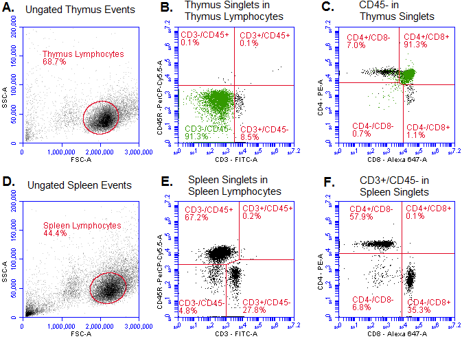

*Flow cytometric comparison of lymphocyte populations in mouse spleen and thymus*
===========================

Some diseases compromise the immune system and this can manifest in lymphocyte populations. The relative proportion of cell phenotypes across organs provides information on disease progression. For example, declining T helper counts mark the transition from human immunodeficiency virus to acquired immune deficiency syndrome (Deeks et al. 2015). The main technique for such an analysis is flow cytometry (Maecker, McCoy & Nussenblatt 2012). It is imperative to the continued improvement of standardised immunophenotyping assays that a diverse range of data be collected.

B and T cells are lymphocytes of interest in the flow cytometric measurement of disease. The means of distinguishing cell types is through cluster of differentiation (CD) surface markers (Malviya et al. 2010). These cell surface markers change consistently throughout lymphocyte development. As targets of fluorophore conjugated antibodies they allow cell types to be quantified in different tissues.

T lymphocytes have three notable CD combinations. These include two mature T cell types, CD4 helper and CD8 cytotoxic, and one immature double-positive type (Sallusto et al. 1999, Ladi et al. 2006). Mature T cells have differentiated via thymopoiesis to express CD3 and one of the two markers (i.e. CD4 or CD8). Immature T cells express CD3 at very low levels, and as double-positives, express both CD4 and CD8 (Levelt, Ehrfeld & Eichmann 1993, Yassai & Gorski 2000). Unlike T cells, B cells are often characterised as a single population through the expression CD45R alone. Known as B220 in mice, this CD is an important component of B cell development (Hathcock et al. 1992).

Different organs have unique roles in lymphocyte development and contain distinct cell populations. T cells develop in the thymus, meaning that it contains immature double-positive cells as well as mature CD4 helper and CD8 cytotoxic cells (Ladi et al. 2006). This organ does not substantially contribute to B cell maturation and contains only low populations (Perera & Huang 2015). By contrast, the spleen is important for B cell development, containing a substantial number of this lymphocyte (Loder et al. 1999, Mebius & Kraal 2005). Additionally, both organs often contain more helper than cytotoxic T cells, especially the thymus. This manifests as a larger CD4:CD8 ratio in the thymus, due to its role in thymopoiesis, than the spleen (Sinclair et al. 2013).

It was hypothesised that a mouse thymus would contain all T cell phenotypes (i.e. double-positive, helper and cytotoxic), yet lack B cells. Furthermore, that a mouse spleen would contain B cells, mature helper and cytotoxic T cell phenotypes, and lack immature double-positive T cells. Finally, that there would be a greater number of helper T cells than cytotoxic, particularly in the thymus.

The objectives of the lab were to extract thymus and spleen samples from a mouse and utilise flow cytometry to quantify lymphocyte populations. The purpose was to determine whether lymphocyte population data matched that hypothesised based on prior research.

It was found that thymus contained all T cell phenotypes and lacked B cells, while spleen had B cells yet lacked immature T cells. These results suggest that the thymus plays an important role in T cell maturation, and the spleen in B cell maturation.

METHOD
===========================

A thymus and spleen were sourced from a female POMC-TC-GFP (Dodd et al. 2015, Loh et al. 2011) mouse at six weeks of age. The transgenic modification had no theoretical or observed impact on the research. Organs were dissected following CO² asphyxiation and pushed through a cell strainer into Roswell Park Memorial Institute (RPMI) medium. Cells were washed in Phosphate Buffer Saline (PBS), incubated in Red Blood Cell lysing solution, and resuspended in RPMI.

Cell concentration was quantified via haemocytometer. Six samples per organ of RPMI and 5% Fetal Calf Serum were prepared, each containing 2x10⁶ viable cells/mL. Treatment stains (i.e. antibody types) for the six thymus and six spleen samples were identical. They included one no-stain control, four single stains (i.e. CD3-FITC, CD45R-PerCP-Cy5.5, CD8a-Alexa-647, or CD4-PE), and one mixed stain containing all antibodies. Samples were covered and incubated on ice for 30 min.

The solution from each sample was removed by centrifuge and resuspended in flow cytometry buffer in flow cytometry tubes. Data was collected on an Accuri C6 flow cytometer according to manufacturer instructions. At least 2x10⁴ events within the likely lymphocyte forward and side scatter region were collected for each thymus and spleen staining sample. Flow Cytometry Compensation Beads were run prior to experimental samples and fluorescence compensation values set accordingly. Experimental data was analysed in BD Accuri C6 Plus (ver. 1.0.17.1).

Data for the two mixed stains was analysed and a similar gating strategy was used for both. Lymphocytes were selected using forward and side scatter, then singlets were gated from doublets using forward scatter against height. Singlet events were analysed, then thymus singlets were gated for CD45R- expression and spleen singlets for CD3-/CD45R- expression.

RESULTS
===========================

Each organ had one no-stain control, four single stain samples (i.e. CD3-FITC, CD45R-PerCP-Cy5.5, CD8a-Alexa-647, or CD4-PE) and one mixed stain incubated with all four antibodies. All samples had light scatter values fitting viable splenocyte and thymocyte cell suspensions.

The no-stain control for both organs did not fluoresce on any wavelength beyond minimal expected autofluorescence. All four spleen single stain samples included events that fluoresced at wavelengths matching dye and organ characteristics. Of the four thymus single stains, three fluoresced and CD45R-PerCP-Cy5.5 did not, instead correctly resembling the no-stain thymus control.

Flow cytometry data from the mixed stain (i.e. all four antibodies) was used for the thymus and spleen lymphocyte analysis. Events for both organs are plot below in Figure 1.

Figure 1. Flow cytometry events for thymus (A, B, C) and spleen (D, E, F) mixed stains by wavelength. Gating was applied consecutively from left to right intra-organ. Thymus lymphocyte populations were selected (A), singlets were gated (not shown), and the first fluorescent comparison (B) showed no CD3-/CD45R+ events (B cells). Gating for CD45R-, fluorescence (C) showed CD3-/CD4+/CD8+ events (immature double-positive T cells) as green and CD3+ events with either CD4+ or CD8+ (mature T cells) as black. For the selected spleen lymphocyte (D) singlet population, the first fluorescent comparison (E) included many CD3-/CD45R+ events (B cells) and few CD3-/CD45R- events. Gating for CD3+/CD45R- events (mature T cells), fluorescence (F) segregated events into CD4+ (helper T cell) or CD8+ (cytotoxic T cell) events.

Density plots of all events provided an overall view of cell populations in thymus and spleen samples. Both organs had populations of monocytes and granulocytes, indicated by greater forward and side scatter relative to lymphocytes. Events with the lowest scatter signal, clearest in the spleen sample, were likely a combination of cellular debris and dead cells.

CD3-/CD45R+ events (B cells) were absent from the thymus mixed stain, representing only 0.1% of singlets (Fig 1. B). By contrast, these events were the majority of the splenocyte population, totalling 67.2% of spleen singlets (Fig 1. E).

T cell phenotype analysis required gating lymphocyte singlets by CD3/CD45 epitopes and then measuring CD4/CD8 expression. Gated for CD45R-, all 91.3% of CD3- thymus singlets (green) expressed the double-positive CD4+/CD8+ phenotype of immature T cells (Fig 1. C). Such epitope expression is indicative of early T cell development when membrane CD3 levels are below the threshold of detection. The majority of the remaining 8.5% of CD3+ thymus singlets were distributed across mature T cell phenotypes (i.e. 7.0% CD4+ helper, 1.1% CD8+ cytotoxic).

No CD3-/CD4+/CD8+ events (immature double-positive T cells) presented in spleen lymphocytes. Gated for CD3+/CD45R- (Fig 1. F), all except 6.8% of spleen singlets were distributed across mature T cells (i.e. 57.9% CD4+ helper, 35.3% CD8+ cytotoxic). Expanding gating to include CD3-/CD45R- events (not shown) merely increased the proportion of double-negative CD4-/CD8- events. Both organs had more CD4+ events than CD8+, and the CD4:CD8 ratio was higher in the thymus (7/1.1 = 6.4) than spleen (57.9/35.3 = 1.6).

DISCUSSION
===========================

Lymphocyte populations are an important indicator in diseases that impact immune function. The overarching question of this study was whether the proportion and phenotype of lymphocytes differed between organs. Four points summarise the findings. First, control samples did not fluoresce and single stains fluoresced according to expected spectrum and organ. Second, B cell counts were very low in the thymus, while all three T cell phenotypes were high. Third, B cells were present in spleen, yet the immature T cell phenotype was not. Fourth and finally, both organs had more CD4 T helper cells than CD8 T cytotoxic, especially the thymus. The following paragraphs interpret the meaning of each point in succession.

The absence of fluorescence in no-stain controls meant that samples would not produce signal interfering with later stains and were free from contamination. Similarly, appropriate fluorescence in single stains showed that each antibody and dye was functional and suited for the experimental mixed stain.

All T cell phenotypes, including immature double-positive cells, were present in the thymus. This result is indicative of the role this organ plays in T cell development prior to release into circulation (Ladi et al. 2006). The further absence CD3+ B cells (Perera & Huang 2015) corroborated thymopoiesis as being a primary role of the thymus.

While absent in the thymus, CD3+ B cells were abundant and clear in the spleen. This aligned with the expectation that this organ has a role in B cell maturation (Hathcock et al. 1992). Moreover, the absence of immature double-positive T cells meant the spleen was unlikely to play a role in T cell development.

Finally, both the thymus and spleen samples contained more CD4 helper T cells that CD8 cytotoxic. As this is an aspect of T cell development, the larger CD4:CD8 ratio in the thymus compared to the spleen supported its role in that development (Sinclair et al. 2013).

These results matched what was expected in the three study hypotheses. Thymus was positive for all T cell phenotypes, while lacking substantial B cell events. Spleen contained B cells and mature T cells, yet lacked immature T cells (i.e. double-positives). Finally, there were more helper T cells than cytotoxic, and this relationship was most evident in thymus.

A methodological limitation of this study was the lack of isotype and viability controls. Isotype controls, meaning antibodies that should not bind to antigens in the samples, would have characterised the magnitude of background surface staining and non-specific binding. Viability controls, meaning DNA or protein binding stains, would allow identification and thus gating of dead cells and debris that may cause false positives.

The dependence on flow cytometry itself introduced several technical limitations to the study. It is expensive in terms of equipment, time and staff qualifications. Attempts to reduce costs (e.g. reducing antibody incubation time) risk corrupting the research product. Finally, it is constrained to known antibodies and by the spectral characteristics of conjugated stains, in turn narrowing research questions and distorting field progression.

CONCLUSION
===========================

Flow cytometry may be used to assay thymocyte populations and show that the thymus is involved in development of T cell phenotypes. The spleen does not share this role, lacking immature T cells, yet containing B cells and participating in their development. Both organs had greater populations of T helper cells, an artefact of cell development most evident in the thymus.

REFERENCES
===========================

Deeks, SG, Overbaugh, J, Phillips, A & Buchbinder, S 2015, 'HIV infection', Nature Reviews Disease Primers, vol. 1, pp. 15035.

Dodd, GT, Decherf, S, Loh, K, Simonds, SE, Wiede, F, Balland, E, Merry, TL, Münzberg, H, Zhang, Z, Kahn, BB, Neel, BG, Bence, KK, Andrews, ZB, Cowley, MA & Tiganis, T 2015, 'Leptin and insulin act on POMC neurons to promote the browning of white fat', Cell, vol. 160, no. 1-2, pp. 88-104.

Hathcock, KS, Hirano, H, Murakami, S & Hodes, RJ 1992, 'CD45 expression by B cells. Expression of different CD45 isoforms by subpopulations of activated B cells', Journal of Immunology, vol. 149, no. 7, pp. 2286-2294.

Ladi, E, Yin, X, Chtanova, T & Robey, EA 2006, 'Thymic microenvironments for T cell differentiation and selection', Nature Immunology, vol. 7, no. 4, pp. 338-343.

Levelt, CN, Ehrfeld, A & Eichmann K 1993, 'Regulation of thymocyte development through CD3. I. Timepoint of ligation of CD3 epsilon determines clonal deletion or induction of developmental program', The Journal of Experimental Medicine, vol. 177, no. 3, pp. 707-716.

Loder, F, Mutschler, B, Ray, RJ, Paige, CJ, Sideras, P, Torres, R, Lamers, MC & Carsetti, R 1999, 'B cell development in the spleen takes place in discrete steps and is determined by the quality of B cell receptor-derived signals', Journal of Experimental Medicine, vol. 190, no. 1, pp. 75-89.

Loh, K, Fukushima, A, Zhang, X, Galic, S, Briggs, D, Enriori, PJ, Simonds, S, Wiede, F, Reichenbach, A, Hauser, C, Sims, NA, Bence, KK, Zhang, S, Zhang, ZY, Kahn, BB, Neel, BG, Andrews, ZB, Cowley, MA & Tiganis, T 2011, 'Elevated hypothalamic TCPTP in obesity contributes to cellular leptin resistance', Cell Metabolism, vol. 14, no. 5, pp. 684-699.

Maecker, HT, McCoy, JP & Nussenblatt, R 2012, 'Standardizing immunophenotyping for the Human Immunology Project', Nature Reviews Immunology, vol. 12, no. 3, pp. 191-200.

Malviya, G, Galli, F, Sonni, I, Pacilio, M, Signore, A 2010, Targeting T and B lymphocytes with radiolabelled antibodies for diagnostic and therapeutic applications', The Quarterly Journal of Nuclear Medicine and Molecular Imaging, vol. 54, no. 6, pp. 654-676.

Mebius, RE & Kraal, G 2005, 'Structure and function of the spleen', Nature Reviews Immunology, vol. 5, no. 8, pp. 606-616.

Perera, J & Huang, H 2015, 'The development and function of thymic B cells', Cellular and Molecular Life Sciences, vol. 72, no. 14, pp. 2657-2663.

Sallusto, F, Lenig, D, Förster, R, Lipp, M & Lanzavecchia, A 1999, 'Two subsets of memory T lymphocytes with distinct homing potentials and effector functions', Nature, vol. 401, no. 6754, pp. 708-712.

Sinclair, C, Bains, I, Yates, AJ & Seddon, B 2013, 'Asymmetric thymocyte death underlies the CD4:CD8 T-cell ratio in the adaptive immune system', Proceedings of the National Academy of Sciences, vol. 110, no. 31, pp. 2905-2914.

Yassai, M & Gorski, J 2000, 'Thymocyte maturation: Selection for in-frame TCR alpha-chain rearrangement is followed by selection for shorter TCR beta-chain complementarity-determining region 3', The Journal of Immunology, vol. 165, no. 7, pp. 3706-3712.
