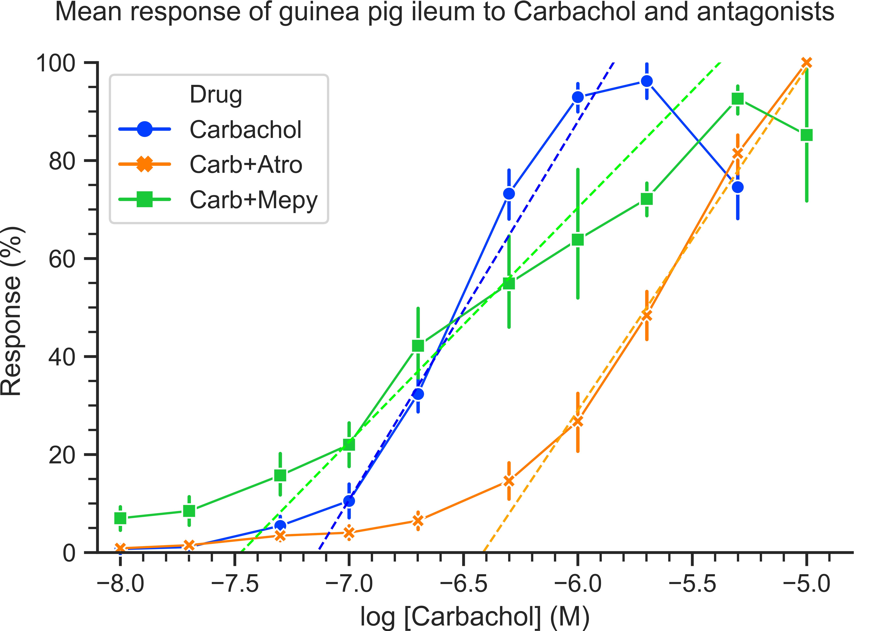
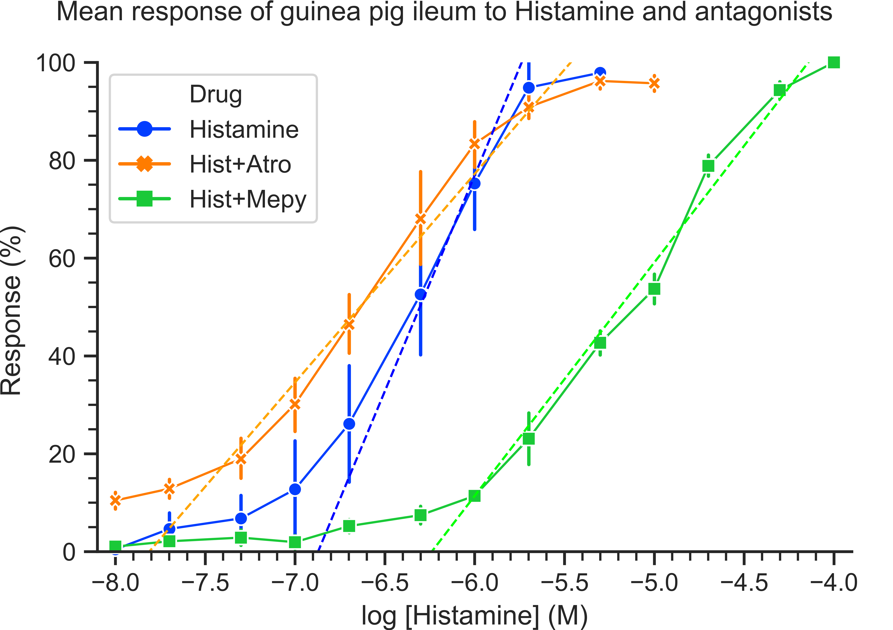

*Guinea pig ileum contraction force in response to carbachol and histamine*
===========================

Different drugs can stimulate, and prevent stimulation, of a diverse range of responses in a variety of tissue types. This is due to agonism and antagonism, or binding with and without activation, of membrane bound receptors. Carbachol (Fenik 2015) and histamine (Panula & Nuutinen 2013) are model drugs for studying selective agonism. The antagonists of these drugs, atropine (Gontijo, Silva-Netto & Furtado 1990) and mepyramine (Krystal, Richelson & Roth 2013) respectively, contribute additional information in terms of drug interactions. A standard for measuring these dose-response relationships is drug-induced muscle contraction, quantified through force transduction (Jespersen et al. 2015). It is imperative to the expansion of basic pharmacodynamic research that response curves exploring model agonist-antagonist connections be collected.

Carbachol is a synthetic compound that binds with the greatest affinity to the muscarinic subtype of acetylcholine receptors (Fenik 2015). The response pathway stimulated by these receptors governs intestinal ileum smooth muscle contraction (Kirschstein et al. 2014). Atropine also binds to muscarinic receptors (Mitchelson 2012). Unlike carbachol however, atropine evokes no cellular response while preventing other compounds from binding. Concurrent treatment thus attenuates overall response, an effect that is reversible when agonist concentrations are sufficient to displace bound antagonist (Gontijo, Silva-Netto & Furtado 1990).

Histamine is an endogenous amine with dual roles as a neurotransmitter and regulator of immunity (Panula & Nuutinen 2013). It binds the H₁ receptor and, similar to carbachol, induces ileum smooth muscle contraction (Simons & Simons 2011). Mepyramine is an H₁ receptor antagonists, binding without instigating a response and blocking the receptor from other compounds (Krystal, Richelson & Roth 2013). This antagonism is reversible at high histamine concentrations, as per the carbachol-atropine relationship above.

Receptor response can be measured through drug-induced muscle contraction, recorded with force transduction instrumentation (Jespersen et al. 2015). Submerged in a tissue bath, ileum is treated with increasing concentrations of agonist while contractile force is registered. Drug interactions are assessed by pre-treating the tissue bath with the experimental antagonist. Dose-response curves are then compared, with right-shifted curves indicating reduced potency (i.e. antagonism), and maximum force (i.e. efficacy) indicating reversibility.

It was hypothesised that carbachol and histamine would increase muscle contraction force proportional to concentration, up to some physiological maximum. Furthermore, that atropine and mepyramine would reversibly antagonise carbachol and histamine respectively.

The objective of the lab was to mount a tissue sample for force transduction and record dose-response curve data with noted experimental compounds. The purpose was to conduct pharmacodynamic analysis of agonist-antagonist interactions in accord with prior research.

All agonist-antagonist conditions had no significant difference in maximum response, meaning any antagonism present was likely reversible. Only in the carbachol and atropine condition was a significant reduction in potency observed (i.e. antagonism). Generalisability was marred by methodological limitations and low data quality.

METHOD
====

Seventeen sections of ileum were dissected from adult wild type guinea pigs following CO² asphyxiation. Samples were approximately 3 cm in length and stored at 34°C in carbogen (95% O₂, 5% CO₂) saturated Holman’s solution. Each was perforated at the two longitudinal ends with strands of cotton thread. Samples were mounted in force transducers and allowed 20 min to equilibrate in organ baths of carbogen saturated Holman’s solution. Registered muscle contraction force was calibrated to 1g and viability confirmed using a 1x10⁻⁵ M dose of carbachol.

Tissue response data was recorded and extracted as force difference in grams (Δg). It was produced using the cumulative addition method, in which drug concentration is increased by fast consecutive drug additions. These were calibrated to raise organ bath concentrations from 1x10⁻⁸ M to 1x10⁻⁵ M in most conditions. Testing concludes when tissue response decreases or the highest concentration is reached. Between each condition the organ bath is drained and refilled three times to wash the sample.

Baseline tissue response was first recorded for the agonists, carbachol and histamine, in all samples. Each was then randomly assigned one of the two antagonists, either atropine or mepyramine. Organ baths were treated with the assigned antagonist to a concentration of 3x10⁻⁸ M and allowed 15 min to equilibrate. Tissue response for each agonist was recorded again as above, with washing and treatment with the assigned antagonist between tests.

Data sets were compared against field expectations for valid cumulative addition dose-response curves and irregular samples excluded. From 4 to 6 data sets were valid for each condition. Rarely was the same ileum sample used as baseline also available for comparison with antagonist conditions. This was catered for by treating data sets as independent samples and using bonferroni corrected non-parametric tests.

Differences between baseline and antagonist response were compared using Kruskal-Wallis H-tests and Mann-Whitney U-test post-hoc comparisons. Group differences in efficacy were tested by comparing the raw maximum Δg response across conditions. Differences in potency were tested by comparing the Half Maximal Effective Concentration (EC₅₀) across conditions. EC₅₀ was calculated by transforming Δg into percentage of maximum response, training trimmed regressions on the EC10-EC90 slope (Frees 1991), and extracting the concentration at 50% response. Data was analysed using Python 3.6.6.1 64-bit (Appendix A).


RESULTS
====
Carbachol and histamine were tested independently on all ileum samples and then with either atropine or mepyramine. All samples showed muscle contraction indicative of viable tissue and results were aggregated by experimental condition for analysis.

Line plots of mean force for each agonist (not shown) provided an overall view of tissue suitability, sample variability and relative force generation. Both agonists had a sigmoidal dose response curve consisting of gradual, rapid and plateauing force as log molar concentration increased. Each exhibited similar maximum force (i.e. efficacy) and sample variability. A Kruskal-Wallis H-test confirmed no significant difference in raw maximum Δg response across conditions for both carbachol (H=1.06, pᵇᵒⁿ=1) and histamine (H=3.12, pᵇᵒⁿ=1).

Relative response percentage data allowed calculation of fitted models for each drug condition and prediction of EC₅₀. Carbachol response was calculated and compared to equivalent response data for each antagonists, shown below in Figure 1.



Figure 1. Mean percentage response of guinea pig ileum to log[Carbachol] in the presence of either antagonist. Neither atropine (n=5) nor mepyramine (n=5) conditions produced a sigmoid dose response curve resembling the carbachol (n=6) control. However, the atropine condition is notably right-shifted relative to the carbachol control and mepyramine condition. The dashed colour-coded lines represent the trimmed regression slope for each sample. Error bars represent SEM.

Antilogged to original units, the average predicted carbachol EC₅₀ was 3.43x10⁻⁷ M. Compared to the mepyramine condition (EC₅₀ = 4.46x10⁻⁷ M) this represented a small 1.30 fold change from baseline. This result is reflected in the centre of the two response curves largely overlapping, despite differences in curve shape. In contrast, the atropine condition (EC₅₀ = 2.00x10⁻⁶ M) produced a larger 5.82 fold change. The response curve of this condition is correspondingly right-shifted relative to the other two curves. A Kruskal-Wallis H-test identified a significant difference in EC₅₀ values (H=9.77, pᵇᵒⁿ<.05). Post hoc Mann-Whitney U-tests found that the significant difference was between baseline and atropine (U=0, pᵇᵒⁿ<.05), not baseline and mepyramine (U=13, pᵇᵒⁿ=1).

As per carbachol, histamine response was calculated and compared to antagonist response data, shown below in Figure 2.



Figure 2. Mean percentage response of guinea pig ileum to log[Histamine] in the presence of either antagonist. The atropine (n=6) condition produced a near complete dose response curve resembling the histamine (n=6) control, plateauing at the highest concentration tested. The mepyramine (n=4) condition did not, being substantially right-shifted relative to histamine and atropine. The dashed colour-coded lines represent the trimmed regression slope for each sample. Error bars represent SEM.

None of the histamine conditions decreased substantially at the highest concentrations. Nevertheless, atropine plateaued at concentration dose higher than histamine, providing some corroboration that the control curve was suitable for subsequent comparisons.

The average predicted histamine EC₅₀ was 5.17x10⁻⁷ M. Compared to the atropine condition (EC₅₀ = 2.72x10⁻⁷ M) there was a small reduced fold change of 0.53, indicating increasing potency. Both curves largely overlapped and were similarly shaped. In contrast, the mepyramine condition (EC₅₀ = 6.42x10⁻⁶ M) produced a very large 12.41 fold change. This response was the greatest fold change difference of all conditions and presents as a right-shift of the mepyramine curve. However, SEM variation is large and no significant group difference in EC₅₀ values was identified by a Kruskal-Wallis H-test (H=8.60, pᵇᵒⁿ=.11). The mepyramine curve was also inclined to the highest concentration, meaning the data set was incomplete, permitting only cautious interpretation in the discussion.


DISCUSSION
====

Pharmacodynamic research relies on dose-response curves to explore relationships between agonists that stimulate responses and antagonists that suppress them. The overarching question of this study was whether atropine and mepyramine reversibly antagonise carbachol and histamine respectively. Three points summarise the findings. First, increasing concentrations of both carbachol and histamine stimulated muscle contraction force up to a physiological maximum. Second, for both agonists there was no difference in maximum force in the presence of the antagonists. Third and finally, atropine reduced carbachol potency, yet mepyramine did not significantly reduce histamine potency. The following paragraphs interpret the meaning of each point in succession.

In support of prior research (Kirschstein et al. 2014, Simons & Simons 2011), carbachol and histamine both produced dose-response curves indicative of model agonists. Muscle contraction force increased proportional to concentration to a maximum value then plateaued or decreased. They served as a representative baseline for subsequent comparisons.

For both agonists, there were no differences between baseline maximum contraction force and that exerted in the presence of antagonists. This meant that wherever significant antagonism took place, it was reversible when agonist concentrations were sufficient to displace antagonist receptor binding. However, the absence of curve plateauing at high concentrations weakens these results, which was likely due to time effects and is discussed below in limitations.

Carbachol potency was significantly reduced by the atropine agonist, as expected from prior research (Gontijo, Silva-Netto & Furtado 1990). Pre-treatment with atropine blocked muscarinic receptors without inducing contraction and higher carbachol concentrations were needed to produce the same effect. In conflict with the literature (Krystal, Richelson & Roth 2013), and readily apparent right-shifting of the dose-response curve, mepyramine did not significantly reduce potency. This was likely due to sample size and variation, discussed further in limitations.

The prototypical dose-response curves that were produced supported the first hypothesis for both agonist. However, the seconds hypothesis was only partially supported. Although equivalent maximum contraction force indicated reversibility, antagonism itself was only established for carbachol and atropine, not histamine and mepyramine.

Several technical limitations weakened study result by introducing random variation. Prominent examples include hand-pipetting of experimental compounds into organ baths, manual mounting of ileum, and variability in sample tissue mass, density and muscle quality. Such variation impacted data quality and resulted in sample sizes too low to find expected drug relationships. If data quality were improved fewer sets will warrant exclusion and more powerful repeated measures statistical analyses can be used. Future research would benefit from automated drug delivery systems, standardised mounting and tissue selection.

There were also methodological limitations in the study design. The discrete addition method is more accurate and reliable than the cumulative addition method that was used. Time effects were a confounding factor, as longer organ bath equilibration time and prior drug treatments will alter tissue response. These influences may account for the absence of plateauing maximum responses in later antagonist conditions. Future research should use the discrete addition method and control for time effects through a randomised drug order crossover design.


CONCLUSION
====

All agonist-antagonist interactions between carbachol and atropine, or histamine and mepyramine, were reversible based on equal maximum drug responses across all conditions. However, only in the carbachol and atropine condition was a significant antagonistic reduction in potency observed. Methodological limitations and low data quality reduced the generalisability of results.


REFERENCES
====

Fenik, VB 2015, 'Revisiting antagonist effects in hypoglossal nucleus: Brainstem circuit for the state-dependent control of hypoglossal motoneurons: A hypothesis', Frontiers in Neurology, vol. 6, pp. 254.

Frees, EW 1991, 'Trimmed slope estimates for simple linear regression', Journal of Statistical Planning and Inference, vol. 27, no. 2, pp. 203-221.

Gontijo, JA, Silva-Netto, CR & Furtado, MR 1990, 'Inhibition of gastric acid secretion by cholinergic stimulation of the lateral hypothalamic area', Brazilian Journal of Medical and Biological Research, vol. 23, no. 3-4, pp. 361-365.

Jespersen, B, Tykocki, NR, Watts, SW & Cobbett, PJ 2015, 'Measurement of smooth muscle function in the isolated tissue bath-applications to pharmacology research', Journal of Visualized Experiments, vol. 95, pp. 52324.

Kirschstein, T, Protzel, C, Porath, K, Sellmann, T, Köhling, R & Hakenberg, OW 2014, 'Age-dependent contribution of Rho kinase in carbachol-induced contraction of human detrusor smooth muscle in vitro', Acta Pharmacologica Sinica, vol. 35, no. 1, pp. 74-81.

Krystal, AD, Richelson, E & Roth, T 2013, 'Review of the histamine system and the clinical effects of H1 antagonists: Basis for a new model for understanding the effects of insomnia medications', Sleep Medicine Reviews, vol. 17, no. 4, pp. 263-272.

Mitchelson, F 2012, 'Muscarinic receptor agonists and antagonists: Effects on ocular function', Handbook of Experimental Pharmacology, vol. 208, pp. 263-298.

Panula, P & Nuutinen, S 2013, 'The histaminergic network in the brain: Basic organization and role in disease', Nature Reviews Neuroscience, vol. 14, no. 7, pp. 472-487.

Simons, FE & Simons, KJ 2011, 'Histamine and H1-antihistamines: Celebrating a century of progress', Journal of Allergy and Clinical Immunology, vol. 128, no. 6, pp. 1139-1150.


APPENDIX A. Python code
====
``` python
"""
WinPython 3.6.6.1Zero.exe
~\WPy-3661\WinPython Command Prompt.exe
python.exe -m pip install --upgrade pip
pip install spyder
pip install matplotlib
pip install pandas
pip install seaborn
pip install statsmodels
"""
import numpy as np
import pandas as pd
import seaborn as sns
import matplotlib.pyplot as plt
import scipy.stats as stats
sns.set(style='ticks', palette='bright')
pd.set_option('display.max_columns', 10)

# Data
df = pd.DataFrame({'JR Carb (g)' : [0.007,0.002,0.009,0.018,0.816,1.604,1.684,2.083,1.163,np.NaN,np.NaN,np.NaN,np.NaN],
MJ Carb (g)' : [0.011,0.018,0.134,0.253,0.417,0.588,0.881,1.000,0.802,np.NaN,np.NaN,np.NaN,np.NaN],
DD Carb (g)' : [0.001,0.015,0.026,0.084,0.260,0.689,1.036,1.135,1.132,np.NaN,np.NaN,np.NaN,np.NaN],
JA Carb (g)' : [0.011,0.008,0.017,0.020,0.330,0.915,1.210,1.242,0.858,np.NaN,np.NaN,np.NaN,np.NaN],
AP Carb (g)' : [0.001,0.007,0.062,0.090,0.153,0.568,0.731,0.719,0.428,np.NaN,np.NaN,np.NaN,np.NaN],
SO Carb (g)' : [0.039,0.042,0.156,0.367,0.998,2.135,2.333,1.841,1.961,np.NaN,np.NaN,np.NaN,np.NaN],
JA CarbX (g)' : [0.000,0.002,0.009,0.021,0.066,0.198,0.325,0.835,1.365,1.559,np.NaN,np.NaN,np.NaN],
MJ CarbX (g)' : [0.027,0.039,0.089,0.112,0.162,0.355,0.576,0.774,1.117,1.183,np.NaN,np.NaN,np.NaN],
AL CarbX (g)' : [0.003,0.003,0.022,0.023,0.063,0.086,0.138,0.478,0.993,1.311,np.NaN,np.NaN,np.NaN],
AP CarbX (g)' : [0.008,0.019,0.048,0.037,0.033,0.120,0.378,0.515,0.738,1.050,np.NaN,np.NaN,np.NaN],
TJ CarbX (g)' : [0.020,0.041,0.059,0.085,0.136,0.257,0.373,0.778,1.649,2.079,np.NaN,np.NaN,np.NaN],
AH CarbY (g)' : [0.304,0.274,0.912,1.290,1.826,2.369,2.878,3.099,3.403,4.031,np.NaN,np.NaN,np.NaN],
HE CarbY (g)' : [0.014,0.055,0.085,0.168,0.440,0.768,1.076,0.839,1.224,0.401,np.NaN,np.NaN,np.NaN],
SY CarbY (g)' : [0.290,0.370,0.569,0.638,1.321,1.601,1.724,1.587,1.761,1.941,np.NaN,np.NaN,np.NaN],
ZM CarbY (g)' : [0.200,0.230,0.310,0.448,0.953,1.083,1.171,1.236,1.821,2.069,np.NaN,np.NaN,np.NaN],
SJ CarbY (g)' : [0.041,0.022,0.117,0.243,0.388,0.453,0.361,1.840,2.490,2.320,np.NaN,np.NaN,np.NaN],
ZM Hist (g)' : [0.001,0.104,0.146,0.300,0.439,0.563,0.599,0.717,0.686,np.NaN,np.NaN,np.NaN,np.NaN],
AL Hist (g)' : [0.014,0.023,0.026,0.058,0.118,0.185,0.780,1.329,1.674,np.NaN,np.NaN,np.NaN,np.NaN],
AP Hist (g)' : [0.006,0.024,0.012,0.053,0.239,0.638,0.918,1.058,1.018,np.NaN,np.NaN,np.NaN,np.NaN],
SO Hist (g)' : [0.006,0.009,0.085,0.013,0.281,1.250,1.740,2.067,2.059,np.NaN,np.NaN,np.NaN,np.NaN],
JA HistX (g)' : [0.200,0.345,0.625,0.832,1.156,1.457,1.548,1.634,1.599,1.525,np.NaN,np.NaN,np.NaN],
JR HistX (g)' : [0.273,0.350,0.562,0.911,1.531,1.957,2.362,2.538,2.675,2.419,np.NaN,np.NaN,np.NaN],
AL HistX (g)' : [0.111,0.172,0.242,0.416,0.791,1.251,1.466,1.637,1.599,1.795,np.NaN,np.NaN,np.NaN],
AP HistX (g)' : [0.198,0.160,0.263,0.472,0.566,1.145,1.118,1.090,1.135,1.186,np.NaN,np.NaN,np.NaN],
CZ HistX (g)' : [0.035,0.037,0.031,0.052,0.096,0.093,0.212,0.220,0.265,0.240,np.NaN,np.NaN,np.NaN],
TJ HistX (g)' : [0.071,0.101,0.120,0.225,0.383,0.754,1.038,1.431,1.607,1.699,np.NaN,np.NaN,np.NaN],
SY HistY (g)' : [-0.001,0.010,0.003,0.001,0.012,0.023,0.036,0.028,0.133,0.156,0.286,0.335,0.340],
AH HistY (g)' : [0.009,0.035,0.123,0.067,0.152,0.231,0.213,0.500,0.708,1.026,1.390,1.631,1.709],
HE HistY (g)' : [0.008,-0.001,-0.002,-0.020,0.045,0.043,0.121,0.242,0.528,0.669,0.990,1.207,1.316],
ZM HistY (g)' : [0.013,0.014,0.014,0.020,0.020,0.025,0.053,0.145,0.199,0.231,0.297,0.365,0.398]
})
for i in range(0,len(df.columns)):
df[df.columns.str.replace('g', '%')[i]] = df.iloc[:,i]/df.iloc[:,i][df.iloc[:,i].idxmax()]*100
df.index = [1.00E-08,2.00E-08,5.00E-08,1.00E-07,2.00E-07,5.00E-07,1.00E-06,2.00E-06,5.00E-06,1.00E-05,2.00E-05,5.00E-05,1.00E-04]
df = df.stack()
df = df.reset_index()
df.columns = ['Concentration','Sample','Response']
conds = ['Carbachol','Carb+Atro','Carb+Mepy','Histamine','Hist+Atro','Hist+Mepy']
df['Drug'] = ''
for i, j in zip([' Carb ',' CarbX ',' CarbY ',' Hist ',' HistX ',' HistY '], conds):
df['Drug'] = np.where(df['Sample'].str.contains(i), j, df['Drug'])

# Models
df['Concentration'] = np.log10(df['Concentration'])
df_reg = df[df['Sample'].str.contains('%')]
df_reg = df_reg.reset_index()
for i in conds:
for j in df_reg.loc[:,'Sample'].drop_duplicates():
logic = (df_reg['Drug'] == i) & (df_reg['Sample'] == j)
z = df_reg.loc[logic].copy()
z.loc[z['Response'].diff() < 0, 'Response'] = np.NaN
x = z.loc[z['Response'].between(10, 90), 'Concentration']
y = z.loc[z['Response'].between(10, 90), 'Response']
if y.empty:
pass
else:
slope, intercept = stats.linregress(x, y)[:2]
df_reg.loc[logic, 'Slope'] = slope
df_reg.loc[logic, 'Intercept'] = intercept
df_reg.loc[logic, 'Line'] = intercept + slope * z.loc[:,'Concentration']

# EC50 and fold change
df_reg['EC50'] = (50-df_reg['Intercept'])/df_reg['Slope']
df_reg['EC50_pow'] = 10 ** df_reg['EC50']
fold = df_reg.loc[:,['Drug','EC50_pow']].groupby(['Drug']).mean()
fold.loc[['Carb+Atro', 'Carb+Mepy'], 'Fold_Change'] = fold.loc[['Carb+Atro', 'Carb+Mepy'], 'EC50_pow'] / float(fold.loc['Carbachol', 'EC50_pow'])
fold.loc[['Hist+Atro', 'Hist+Mepy'], 'Fold_Change'] = fold.loc[['Hist+Atro', 'Hist+Mepy'], 'EC50_pow'] / float(fold.loc['Histamine', 'EC50_pow'])

# Statistical Tests
EC50 = df_reg.loc[:,['Drug','EC50_pow']].drop_duplicates()
EC50 = EC50.set_index('Drug')
x = EC50.loc['Carbachol', 'EC50_pow']
y = EC50.loc['Carb+Atro', 'EC50_pow']
z = EC50.loc['Carb+Mepy', 'EC50_pow']
fold.loc['Carbachol','U_H_Stats'], fold.loc['Carbachol', 'p-value'] = stats.kruskal(x,y,z)
fold.loc['Carb+Atro','U_H_Stats'], fold.loc['Carb+Atro', 'p-value'] = stats.mannwhitneyu(x,y)
fold.loc['Carb+Mepy','U_H_Stats'], fold.loc['Carb+Mepy', 'p-value'] = stats.mannwhitneyu(x,z)
x = EC50.loc['Histamine', 'EC50_pow']
y = EC50.loc['Hist+Atro', 'EC50_pow']
z = EC50.loc['Hist+Mepy', 'EC50_pow']
fold.loc['Histamine','U_H_Stats'], fold.loc['Histamine', 'p-value'] = stats.kruskal(x,y,z)
fold.loc['Hist+Atro','U_H_Stats'], fold.loc['Hist+Atro', 'p-value'] = stats.mannwhitneyu(x,y)
fold.loc['Hist+Mepy','U_H_Stats'], fold.loc['Hist+Mepy', 'p-value'] = stats.mannwhitneyu(x,z)
fold['p-value-adj'] = np.where(fold['p-value'] * 8 <= 1, fold['p-value'] * 8, 1)
print(fold)
Eff = df.loc[df['Sample'].str.contains('g'), ['Drug', 'Response', 'Sample']].groupby(['Sample','Drug']).max().reset_index()
Eff = Eff.loc[:,['Drug','Response']].set_index('Drug')
x = Eff.loc['Carbachol', 'Response']
y = Eff.loc['Carb+Atro', 'Response']
z = Eff.loc['Carb+Mepy', 'Response']
Eff.loc['Carbachol','U_H_Stats'], Eff.loc['Carbachol', 'p-value'] = stats.kruskal(x,y,z)
x = Eff.loc['Histamine', 'Response']
y = Eff.loc['Hist+Atro', 'Response']
z = Eff.loc['Hist+Mepy', 'Response']
Eff.loc['Histamine','U_H_Stats'], Eff.loc['Histamine', 'p-value'] = stats.kruskal(x,y,z)
Eff['p-value-adj'] = np.where(Eff['p-value'] * 8 <= 1, Eff['p-value'] * 8, 1)
print(Eff.loc[-np.isnan(Eff['U_H_Stats']), Eff.columns != 'Response'].drop_duplicates())

# Figure 1
ax = sns.lineplot(x = 'Concentration',
y = 'Response',
hue = 'Drug',
style = 'Drug',
data = df[df['Sample'].str.contains('%') & df['Drug'].str.contains('Carb')],
aa = True,
clip_on = False,
markers = True,
lw = 1,
dashes = False,
ci = 68,
err_style = 'bars',
estimator = 'mean',
)
for i, j in zip(['Carbachol','Carb+Mepy','Carb+Atro'], ['blue', 'lime', 'orange']):
x = df_reg.loc[df_reg['Drug'] == i, 'Concentration'].drop_duplicates()
y = df_reg.loc[df_reg['Drug'] == i].groupby(['Drug', 'Concentration']).mean().reset_index()['Line']
plt.plot(x, y, linewidth = 1, color=j, linestyle = '--')
ax.set(xlim = (-8.1,-4.8),
ylim = (0,100),
title = 'Mean response of guinea pig ileum to Carbachol and antagonists        \n',
xlabel = 'log [Carbachol] (M)',
ylabel = 'Response (%) '
)
ax.minorticks_on()
sns.despine()
plt.savefig('Fig_1.png',
dpi = 1000,
bbox_inches = 'tight',
pad_inches = 0)
plt.show()

# Figure 2
ax = sns.lineplot(x = 'Concentration',
y = 'Response',
hue = 'Drug',
style = 'Drug',
data = df[df['Sample'].str.contains('%') & df['Drug'].str.contains('Hist')],
aa = True,
clip_on = False,
markers = True,
lw = 1,
dashes = False,
ci = 68,
err_style = 'bars',
estimator = 'mean',
)
for i, j in zip(['Histamine','Hist+Mepy','Hist+Atro'], ['blue', 'lime', 'orange']):
x = df_reg.loc[df_reg['Drug'] == i, 'Concentration'].drop_duplicates()
y = df_reg.loc[df_reg['Drug'] == i].groupby(['Drug', 'Concentration']).mean().reset_index()['Line']
plt.plot(x, y, linewidth = 1, color=j, linestyle = '--')
ax.set(xlim = (-8.1,-3.9),
ylim = (0,100),
title = 'Mean response of guinea pig ileum to Histamine and antagonists        \n',
xlabel = 'log [Histamine] (M)',
ylabel = 'Response (%) '
)
ax.minorticks_on()
sns.despine()
plt.savefig('Fig_2.png',
dpi = 1000,
bbox_inches = 'tight',
pad_inches = 0)
plt.show()
```
