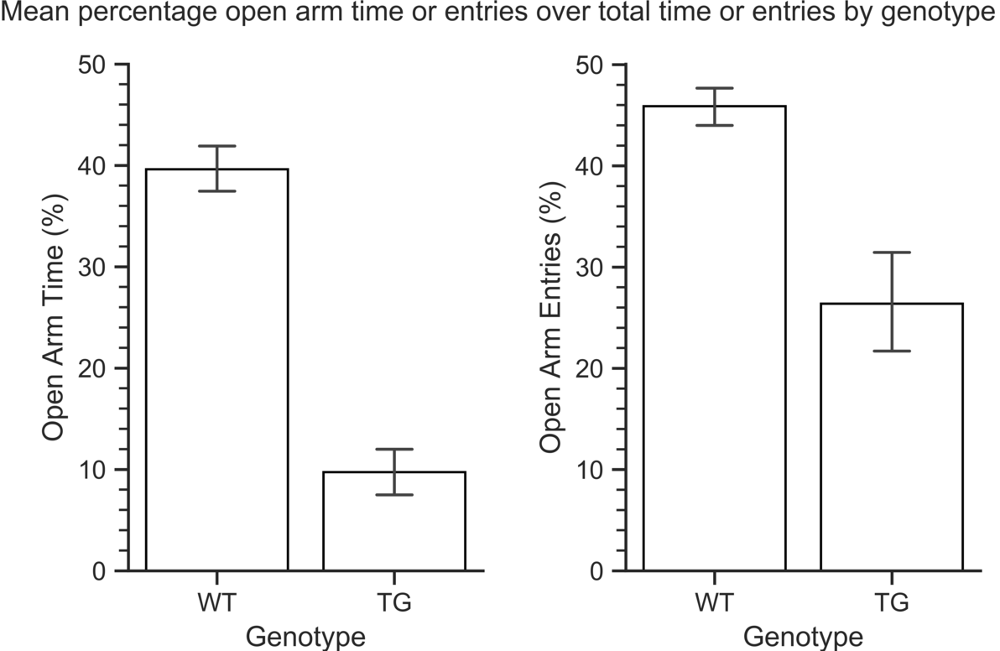
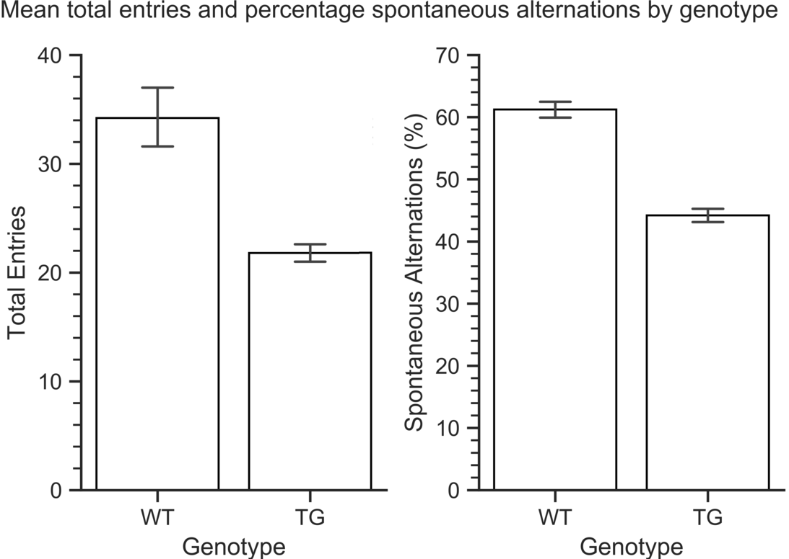

*Emotional dysregulation and cognitive decline in a transgenic Alzheimer's Disease mouse model*
====

In 2016 Alzheimer's Disease (AD) was the underlying cause of death for 4,279 (13.2 per 10⁴) Australians (ABS 2017). The debilitating and progressive nature of this condition has sobering implications for both individuals and society. Further research on AD is imperative to mitigate the ongoing harm.

AD comes in many forms and symptoms often overlap with other variants of dementia. The most common definition is regional aggregation of two insoluble proteins. Specifically, extracellular β-amyloid (Aβ) plaques and intracellular tau protein tangles (Masters et al. 2015). Independently and in concert, these inclusions cause a panoply of psychological and neurological disruptions.

The human AD symptoms of interest for this research were emotional dysregulation and cognitive decline. In order to study these broad categories of experience they had to be operationalised into measurable observations. As such, emotional dysregulation was measured through anxiety, and cognitive decline was measured through locomotor activity and spatial working memory.

Human AD precedes neuropsychiatric disabilities punctuated by emotional dysregulation (McKeith & Cummings 2005). Anxiety is common (Ferretti et al. 2001) and pooled meta-analysis indicate that 39% of AD sufferers experience clinically meaningful increases (Zhao et al. 2016). In humans assessment relies on self-report as minimal outward symptomology can belie great internal discord. In rodents, where self-report is unavailable, researchers use the Elevated Plus Maze (EPM), a well-established behavioural test for anxiety (Carobrez & Bertoglio 2005). Within this paradigm transgenic AD mice show increased anxiety (Pentkowski et al. 2018).

In contrast to hidden psychological disturbances, early-onset impairments in locomotor activity are straightforward to assess (Albers et al. 2005). For humans it manifests in neuromotor dysfunction and impaired movement causing a marked reduction in quality of life. Locomotor activity can be measured directly in rodents via the EPM (Karl, Pabst & von Hörsten 2003, Sestakova et al. 2013). From an early stage impairments present in Aβ-infused rats and this reflects cognitive decline in humans (Dao et al. 2014).

Spatial working memory was the second form of cognitive decline within this research. AD patients suffer impairments and the severity indicates the progression of the disease (Guariglia 2007). The Y-Maze is used to directly test the expression of spatial working memory in mice (Lalonde 2002). Transgenic AD mouse models show similar impairment in spatial working memory as in humans (Oakley et al. 2006, Ohno et al. 2004, Holcomb et al. 1998).

As the above literature indicates it is common practice to use transgenic AD rodents in behavioural testing. This is by necessity, as Aβ plaques do not aggregate in wild-type animals as in humans. Animal age and generalisability are important considerations in the use of such models. Before testing the animals must be old enough for the AD condition to form in that breed. For generalisability, the nature of AD formed should closely resemble human AD.

It was hypothesised that AD transgenic mice would show increased anxiety in the EPM. Furthermore, it was hypothesised that AD mice would show reduced locomotor activity in the EPM and spatial working memory in the Y-Maze.

The objective of this research was to behaviourally test transgenic AD mice and derive meaningful response data. The purpose was to gain insights into AD symptomology through mouse model testing in accord with prior research.

The transgenic AD mice presented with significant increases in anxiety, as can be related to emotional dysregulation in humans. Similarly, transgenic AD mice showed significantly reduced motor activity and spatial working memory, indicative of cognitive decline. Generalisability was marred by technical and methodological limitations.
METHOD
Testing included eight wild-type control mice and seven transgenic (N=15), all male, purchased from The Jackson Laboratory. They were housed in standard vivarium conditions (i.e. 21°C ± 1°C, 12HR light/dark cycle, ad libitum chow/water). Animal treatment complied with Monash University Animal Ethics Committee guidelines.

C57BL/6J mice (Russell et al. 2016), the accepted literature standard, were used for wild-type controls. B6C3-Tg transgenic mice were used for the AD group (Jankowsky et al. 2001). Mutations include chimeric mouse/human amyloid precursor protein (AβPPswe) and humanised presenilin 1 (PSEN1dE9). Consequently, at seven months old B6C3-Tg express insoluble Aβ plaques indicative of early-onset AD. Behavioural testing commenced at ten months to ensure inclusion maturity.

Anxiety and motor activity were tested via EPM (Carobrez & Bertoglio 2005, Karl, Pabst & von Hörsten 2003, Sestakova et al. 2013). The maze is '+' shaped, with two opposing open and closed arms, elevated 75cm from the ground. This provokes open arm exploratory behaviour or avoidance during each ten minute test. Two metrics of anxiety and one of motor activity can be derived from the resulting data. Percentage time in open arms, and percentage entries into open arms, vary inversely to anxiety. Total arm entries measures motor activity.

Spatial working memory was tested via Y-Maze (Lalonde 2002). The maze is 'Y' shaped with three closed arms and visual cues to serve as reference points. As with the EPM, this provokes entering and leaving arms during each ten minute test. Percentage of nonrepetitive spontaneous arm alternations out of total arm entries measures spatial working memory.

Each mouse endured one test per day to minimise interference effects and stress. Performance was camera recorded, manually scored, and both testing and scoring were single-blinded with respect to group. Detailed protocol information can be retrieved from existing literature (Walf & Frye 2007, Miedel et al. 2017).

Statistical analyses consisted of mean plots and four independent group tests. Budgetary constraints limited sample sizes to five mice per group and this was too low to assume normality. Therefore nonparametric Mann-Whitney U tests with bonferroni corrected p-values were used. Post-study power analysis at α=.05 determined whether the research was underpowered. Data was analysed using Python 3.6.6.1 64-bit (Appendix A).


RESULTS
====

Study results included four comparisons between wild-type and transgenic mice (i.e. genotype). The first two related to emotional dysregulation in the form of EPM anxiety. The second two related to cognitive decline in the form of EPM motor activity and Y-Maze spatial working memory. In each case descriptive bar plots of means precede formal significance testing for differences.

Anxiety was compared across genotypes using mean percentage time in open arms and mean percentage open entries, shown below in Figure 1.



Figure 1. Genotype comparisons of mean percentage open arm time (left) and mean percentage open arm entries (right). Transgenic mice (TG; n=5) exhibited a lower percentage of time spent in open arms, and a lower percentage of open arm entries, relative to wild-type mice (WT; n=5). Sample sizes were equal for both comparisons. Error bars represent SEM.

According to Figure 1, transgenic mice spent less time in the open arms than wild-type controls. They also displayed fewer open arm entries, although greater variability was observed in the transgenic mice for this mean. Mann-Whitney U tests identified significant differences between genotypes for both percentage open arm time (U=0, pᵇᵒⁿ<.05) and percentage open arm entries (U=0, pᵇᵒⁿ<.05). Transgenic mice therefore displayed statistically significant increases in anxiety compared to wild-type controls.

The second pair of genotype comparisons related to cognitive decline. Motor activity was compared using EPM mean total arm entries, while spatial working memory was compared using Y-Maze mean percentage spontaneous alternations, shown below in Figure 2.



Figure 2. Genotype comparisons of mean total arm entries (left) and mean percentage spontaneous alternations (right). Transgenic mice (TG; n=5) exhibited a lower number of EPM total arm entries (raw count), and a lower Y-Maze percentage of spontaneous alternations, relative to wild-type mice (WT; n=5). Sample sizes were equal for both comparisons. Error bars represent SEM.

According to Figure 2, transgenic mice had a lower number of total arm entries in the EPM than wild-type controls. In contrast to EPM anxiety data, greater variability for this mean was observed in wild-type mice, not the transgenic mice. Transgenic mice also exhibited fewer spontaneous alternations in the Y-Maze. Mann-Whitney U tests identified significant differences between genotypes for both total entries (U=0, pᵇᵒⁿ<.05) and spontaneous alternations (U=0, pᵇᵒⁿ<.05). As such, transgenic mice displayed statistically significant decreases in motor activity and spatial working memory compared to wild-type controls.

Power analysis revealed that genotype comparisons of open arm time (1-β=0.983) and spontaneous alternation (1-β=0.996) had ample statistical power. However, comparisons of open arm entries (1-β=0.506) and total entries (1-β=0.566) were underpowered. The latter reductions in power were driven by differences in variability between genotypes, as depicted in SEM bars for each comparison (Figure 1. right, Figure 2. left). Statistical power is less relevant in these cases given that all Mann-Whitney U tests were highly significant.


DISCUSSION
====

AD is a degenerative neurological condition causing emotional dysregulation and cognitive decline in humans. Such constructs can be operationalised in rodents as anxiety, locomotor activity and spatial working memory. The overarching question of this study was whether these variables could be observed in behavioural testing of transgenic mice for the purpose of studying human AD. Three points summarise the findings. First, transgenic mice showed increased anxiety relative to wild-type controls. Second, transgenic mice had reduce locomotor activity. Third and finally, spatial working memory was impaired in transgenic mice
The following paragraphs interpret the meaning of each point in succession.

Transgenic mice had higher levels of anxiety compared to wild-type controls. In behavioural testing this manifested as reduced percentage time and percentage entries into the open arms of the EPM. This result was aligned with what was expected from prior transgenic research (Pentkowski et al. 2018). Importantly, the B6C3-Tg transgenic expresses an AD pathology similar to humans (i.e. Aβ plaques). This affords tentative extension of such results back to human AD, for which the literature identifies anxiety as a late-onset symptom (McKeith & Cummings 2005).

Locomotor activity was reduced in the transgenic mice, as expected from prior research of Aβ-infused animal models (Dao et al. 2014). It was observed in the EPM as fewer total arm entries. Impaired locomotor activity in animals can be generalised back to humans as one factor of cognitive decline seen in early stage AD (Albers et al. 2005). However, the noted increases in anxiety may have impacted this result, as discussed below in limitations.

Finally, spatial working memory was significantly reduce in the transgenic mice. In behavioural testing this manifested as fewer spontaneous alternations in the Y-Maze. This result was aligned with what was expected from prior transgenic research (Oakley et al. 2006, Ohno et al. 2004, Holcomb et al. 1998). Spontaneous alternation is a validated analogue of spatial working memory that directly extends from animals to humans. As such, the result can be interpreted as what may be observed in humans and reflects a similar cognitive decline observed in AD populations (Guariglia 2007).

Several technical limitations weakened the study. EPM and Y-Maze grading was carried out by human interpretation. While this is accepted in the literature, recent technological advances (e.g. RFID, computerised tracking, etc.) obligates future research to improve upon this standard. In terms of test choice, the EPM is only tangentially a test of locomotor activity and more sensitive tests should be favoured (e.g. rotarod). Finally, sample sizes should be increased to allow more powerful parametric statistical analyses.

There were also methodological limitations in study design. Firstly, in B6C3-Tg transgenic mice Aβ plaques accrue in the absence of tau tangles. That symptomology matches some types of dementia, however stricter definitions of AD require both proteins to be expressed. A model with superior generalisability to humans would express the complete AD profile, such as the triple-transgenic 3xTg-AD LaFerla mouse (Oddo et al. 2003). It may also be an advantage to use female mice as they more reliably present with the pathology (Jankowsky & Zheng 2017). Another design issue was that no brain histology was done to confirm Aβ plaque aggregation. Inclusions were assumed yet never confirmed. Finally, anxiety was increased in transgenic mice and this could interfere with other behavioural tests. Unfortunately, catering for this symptom is an ongoing challenge for research, given that anxiety is part of the AD condition itself.


CONCLUSION
====

AD was associated with significant emotional dysregulation in the form of increased anxiety, as determined by EPM using transgenic mice. It was further associated with significant cognitive decline in the form of impaired locomotor activity and spatial working memory, shown by EPM and Y-Maze testing. Generalisability was reduced due to technical and methodological limitations.


REFERENCES
====

Albers, MW, Gilmore, GC, Kaye, J, Murphy, C, Wingfield, A, Bennett, DA, Boxer, AL, Buchman, AS, Cruickshanks, KJ, Devanand, DP, Duffy, CJ, Gall, CM, Gates, GA, Granholm, AC, Hensch, T, Holtzer, R, Hyman, BT, Lin, FR, McKee, AC, Morris, JC, Petersen, RC, Silbert, LC, Struble, RG, Trojanowski, JQ, Verghese, J, Wilson, DA, Xu, S & Zhang, LI 2015, 'At the interface of sensory and motor dysfunctions and Alzheimer's disease', Alzheimer's & Dementia, vol. 11, no. 1, pp. 70-98.

Australian Bureau of Statistics, ‘3303.0 - Causes of Death, Australia, 2017', accessed 5 October 2018 http://www.abs.gov.au/ausstats/abs@.nsf/mf/3303.0

Carobrez, AP & Bertoglio, LJ 2005, 'Ethological and temporal analyses of anxiety-like behavior: The elevated plus-maze model 20 years on', Neuroscience & Biobehavioral Reviews, vol. 29, no. 8, pp. 1193-1205.

Dao, AT, Zagaar, MA, Salim, S, Eriksen, JL & Alkadhi, KA 2014, 'Regular exercise prevents non-cognitive disturbances in a rat model of Alzheimer's disease', International Journal of Neuropsychopharmacology, vol. 17, no. 4, pp. 593-602.

Ferretti, L, McCurry, SM, Logsdon, R, Gibbons, L & Teri, L 2001, 'Anxiety and Alzheimer's disease', Journal of Geriatric Psychiatry and Neurology, vol. 14, no. 1, pp. 52-58.

Guariglia, CC 2007, 'Spatial working memory in Alzheimer's disease: A study using the Corsi block-tapping test', Dementia & Neuropsychologia, vol. 1, no. 4, pp. 392-395.

Holcomb, L, Gordon, MN, McGowan, E, Yu, X, Benkovic, S, Jantzen, P, Wright, K, Saad, I, Mueller, R, Morgan, D, Sanders, S, Zehr, C, O'Campo, K, Hardy, J, Prada, CM, Eckman, C, Younkin, S, Hsiao & K, Duff, K 1998, 'Accelerated Alzheimer-type phenotype in transgenic mice carrying both mutant amyloid precursor protein and presenilin 1 transgenes', Nature Medicine, vol. 4, no. 1, pp. 97-100.

Jankowsky, JL & Zheng H 2017, 'Practical considerations for choosing a mouse model of Alzheimer's disease', Molecular Neurodegeneration, vol. 12, no. 1, pp. 89.

Jankowsky, JL, Slunt, HH, Ratovitski, T, Jenkins, NA, Copeland, NG & Borchelt, DR 2001, 'Co-expression of multiple transgenes in mouse CNS: A comparison of strategies', Biomolecular Engineering, vol. 17, no. 6, pp. 157-165.

Karl, T, Pabst, R & von Hörsten, S 2003, 'Behavioral phenotyping of mice in pharmacological and toxicological research', Experimental and Toxicologic Pathology, vol. 55, no. 1, pp. 69-83.

Lalonde, R 2002, 'The neurobiological basis of spontaneous alternation', Neuroscience & Biobehavioral Reviews, vol. 26, no. 1, pp. 91-104.

Masters, CL, Bateman, R, Blennow, K, Rowe, CC, Sperling, RA, & Cummings, JL 2015, 'Alzheimer's disease', Nature Reviews Disease Primers, vol, 1, no. 15056.

McKeith, I & Cummings, J 2005, 'Behavioural changes and psychological symptoms in dementia disorders', The Lancet Neurology, vol. 4, no. 11, pp. 735-742.

Miedel, CJ, Patton, JM, Miedel, AN, Miedel, ES & Levenson, JM 2017, 'Assessment of spontaneous alternation, novel object recognition and limb clasping in transgenic mouse models of amyloid-β and tau neuropathology', Journal of Visualized Experiments: JoVE, vol. 123.

Oakley, H, Cole, SL, Logan, S, Maus, E, Shao, P, Craft, J, Guillozet-Bongaarts, A, Ohno, M, Disterhoft, J, Van, Eldik, L, Berry, R, Vassar, R. 2006, 'Intraneuronal beta-amyloid aggregates, neurodegeneration, and neuron loss in transgenic mice with five familial Alzheimer's disease mutations: potential factors in amyloid plaque formation', Journal of Neuroscience, vol. 26, no. 40, pp. 10129-10140.

Oddo, S, Caccamo, A, Shepherd, JD, Murphy, MP, Golde, TE, Kayed, R, Metherate, R, Mattson, MP, Akbari, Y & LaFerla, FM 2003, 'Triple-transgenic model of Alzheimer's disease with plaques and tangles: Intracellular Abeta and synaptic dysfunction', Neuron, vol. 39, no. 3, pp. 409-421.

Ohno, M, Sametsky, EA, Younkin, LH, Oakley, H, Younkin, SG, Citron, M, Vassar, R & Disterhoft, JF 2004, 'BACE1 deficiency rescues memory deficits and cholinergic dysfunction in a mouse model of Alzheimer's disease', Neuron, vol. 41, no. 1, pp. 27-33.

Pentkowski, NS, Berkowitz, LE, Thompson, SM, Drake, EN, Olguin, CR & Clark, BJ 2018, 'Anxiety-like behavior as an early endophenotype in the TgF344-AD rat model of Alzheimer's disease', Neurobiology of Aging, vol. 61, pp. 169-176.

Russell, ES, Silvers, WK, Loosli, R, Wolfe, HG & Southard, JL 1962, 'New genetically homogeneous background for dystrophic mice and their normal counterparts', Science, vol. 135, no. 3508, pp. 1061-1062.

Sestakova, N, Puzserova, A, Kluknavsky, M & Bernatova, I 2013, 'Determination of motor activity and anxiety-related behaviour in rodents: methodological aspects and role of nitric oxide', Interdisciplinary Toxicology, vol. 6, no. 3, pp. 126-135.

Walf, AA & Frye, CA 2007, 'The use of the elevated plus maze as an assay of anxiety-related behavior in rodents', Nature Protocols, vol. 2, no. 2, pp. 322-328.

Zhao, QF, Tan, L, Wang, HF, Jiang, T, Tan, MS, Tan, L, Xu, W, Li, JQ, Wang, J, Lai, TJ & Yu, JT 2016, 'The prevalence of neuropsychiatric symptoms in Alzheimer's disease: Systematic review and meta-analysis', Journal of Affective Disorders, vol. 190, pp. 264-271.


APPENDIX A. Python code
====
``` python
# -*- coding: utf-8 -*-
"""
WinPython 3.6.6.1Zero.exe
~\WPy-3661\WinPython Command Prompt.exe
python.exe -m pip install --upgrade pip
pip install spyder
pip install matplotlib
pip install pandas
pip install seaborn
pip install statsmodels
"""

import numpy as np
import pandas as pd
import seaborn as sns
import matplotlib.pyplot as plt
import scipy.stats as stats
sns.set(style='ticks', palette='bright')
pd.set_option('display.max_columns', 10)


# Data
df = pd.DataFrame({'Open Arm (sec)' : [236,182,200,246,176,32,17,74,95,48],
Closed Arm (sec)' : [311,342,277,295,361,503,520,435,475,531],
Open Arm (entries)' : [13,14,20,16,15,5,3,7,8,5],
Closed Arm (entries)' : [15,19,25,14,20,18,21,12,13,17],
Total Entries (#)' : [25,29,19,27,23,16,29,23,21,22],
Alterations (#)' : [13,17,11,15,13,6,13,9,8,9],
Genotype' : ['WT','WT','WT','WT','WT','TG','TG','TG','TG','TG']
})

df['Total Time'] = df['Open Arm (sec)'] + df['Closed Arm (sec)']
df['Total Entries'] = df['Open Arm (entries)'] + df['Closed Arm (entries)']
df['Open Arm Time (%)'] = df['Open Arm (sec)'] / df['Total Time'] * 100
df['Open Arm Entries (%)'] = df['Open Arm (entries)'] / df['Total Entries'] * 100
df['Spontaneous Alternations (%)'] = df['Alterations (#)'] / ( df['Total Entries (#)'] - 2 ) * 100


# One-sided Mann–Whitney U test
df_p = pd.DataFrame(index = ['Open Arm Time (%)','Open Arm Entries (%)','Spontaneous Alternations (%)'])
x = df.loc[df['Genotype'] == 'WT', 'Open Arm Time (%)']
y = df.loc[df['Genotype'] == 'TG', 'Open Arm Time (%)']
df_p.loc['Open Arm Time (%)','U_Stat'], df_p.loc['Open Arm Time (%)', 'p-value'] = stats.mannwhitneyu(x,y)

x = df.loc[df['Genotype'] == 'WT', 'Open Arm Entries (%)']
y = df.loc[df['Genotype'] == 'TG', 'Open Arm Entries (%)']
df_p.loc['Open Arm Entries (%)','U_Stat'], df_p.loc['Open Arm Entries (%)', 'p-value'] = stats.mannwhitneyu(x,y)

x = df.loc[df['Genotype'] == 'WT', 'Total Entries']
y = df.loc[df['Genotype'] == 'TG', 'Total Entries']
df_p.loc['Total Entries','U_Stat'], df_p.loc['Total Entries', 'p-value'] = stats.mannwhitneyu(x,y)

x = df.loc[df['Genotype'] == 'WT', 'Spontaneous Alternations (%)']
y = df.loc[df['Genotype'] == 'TG', 'Spontaneous Alternations (%)']
df_p.loc['Spontaneous Alternations (%)','U_Stat'], df_p.loc['Spontaneous Alternations (%)', 'p-value'] = stats.mannwhitneyu(x,y)

df_p['p-value-adj'] = np.where(df_p['p-value'] * 4 <= 1, df_p['p-value'] * 4, 1)


# Power Analysis
df.groupby(['Genotype']).mean()
np.sqrt(df.groupby(['Genotype']).var())


# Fig 1. Emotional Dysregulation: Open arm time or entries percentage
f, (ax1, ax2) = plt.subplots(1,2)
ax = sns.barplot(x = 'Genotype',
y = 'Open Arm Time (%)',
data = df,
facecolor = (1, 1, 1, 0),
edgecolor = '0',
errwidth = 1.25,
ci = 68,
capsize = .2,
ax=ax1)
ax.set_yticks(ticks=np.arange(0,60,10))
ax.set_yticks(ticks = np.arange(0,50,2), minor = True)
ax = sns.barplot(x = 'Genotype',
y = 'Open Arm Entries (%)',
data = df,
facecolor = (1, 1, 1, 0),
edgecolor = '0',
errwidth = 1.25,
ci = 68,
capsize = .2,
ax=ax2)
ax.set_yticks(ticks = np.arange(0,50,2), minor = True)
ax.set(title = 'Mean percentage open arm time or entries over total time or entries by genotype                                                                  \n')
sns.despine()
plt.savefig('Fig_1.png',
dpi=1000,
bbox_inches='tight',
transparent=True,
pad_inches=0)
plt.show()


# Fig 2. Cognitive Decline: motor activity and spontaneous alterations
f, (ax1, ax2) = plt.subplots(1,2)
ax = sns.barplot(x = 'Genotype',
y = 'Total Entries',
data = df,
facecolor = (1, 1, 1, 0),
edgecolor = '0',
errwidth = 1.25,
ci = 68,
capsize = .2,
ax=ax1)
ax.set_yticks(ticks=np.arange(0,50,10))
ax.set_yticks(ticks = np.arange(0,40,2), minor = True)
ax = sns.barplot(x = 'Genotype',
y = 'Spontaneous Alternations (%)',
data = df,
facecolor = (1, 1, 1, 0),
edgecolor = '0',
errwidth = 1.25,
ci = 68,
capsize = .2,
ax=ax2)
ax.set_yticks(ticks=np.arange(0,80,10))
ax.set_yticks(ticks = np.arange(0,70,2), minor = True)
ax.set(title = 'Mean total entries and percentage spontaneous alternations by genotype                                                                  \n')
sns.despine()
plt.savefig('Fig_2.png',
dpi=1000,
bbox_inches='tight',
transparent=True,
pad_inches=0)
plt.show()
```

